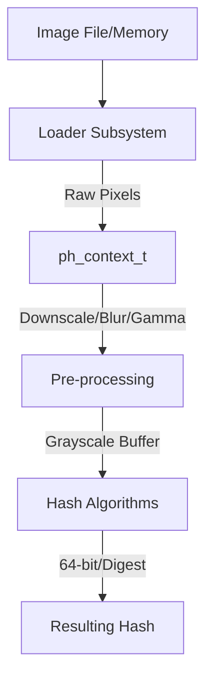

# Architecture Overview

`libphash` is a high-performance C library designed for perceptual image hashing. It prioritizes speed, minimal dependencies, and architectural flexibility.

## Core Components

### 1. Loader Subsystem (`src/loader.c`)
Handles image decoding from files and memory buffers.
- **Backends**: Unified support for `libjpeg-turbo`, `libpng`, `spng`, `libwebp`, and a minimal fallback to `stb_image`.
- **Zero-Copy Pipeline**: Uses memory-mapping (`mmap`) where possible to avoid redundant heap allocations. External decoding libraries directly process the mapped regions into the internal format `ph_context_t`.
- **Fast Grayscale**: Decoders are configured to perform grayscale conversion natively during decompression if requested via `ph_context_set_load_grayscale`, bypassing a secondary RGB-to-gray pass and saving both memory and CPU cycles.

### 2. Image Processing Kernels (`src/image.c`)
Low-level primitives for image manipulation:
- **Resizing**: Area sampling (box filter) for downscaling, bilinear interpolation for upscaling.
- **Grayscale**: SIMD-accelerated (NEON/SSE) color conversion using ITU-R BT.601 coefficients.
- **Filtering**: 3x3 Gaussian blur and Laplacian sharpening.
- **Gamma Correction**: LUT-based gamma normalization (2.2).

### 3. Hash Algorithms (`src/hashes/`)
Divided into specific implementations corresponding to unique theoretical properties:
- `ahash.c`: Average Hash (frequency-based).
- `phash.c`: DCT-based perceptual hash (robust against moderate scaling/rotation).
- `dhash.c`: Gradient-based hash (extremely fast).
- `mhash.c`: Marr-Hildreth or structured block-based logical grid approach.
- `whash.c`: Wavelet-based (DWT Haar) hash supporting fast and full-academic decompositions.
- `bmh.c`: Block Mean Hash, producing high-resolution (256-bit) digest fingerprints.
- `radial.c`: Rotationally invariant spatial sampling.
- `color_moments.c`: Statistical distribution of colors for distinguishing color-unique identical geometry.

## Data Flow

## Key Structures

### `ph_context_t`
The central object containing:
- Loaded pixel data.
- Metadata (width, height, channels).
- Pre-computed LUTs (Gamma).
- Configurable parameters (DCT size, block size, weights).
- Scratchpad memory for zero-allocation processing.
