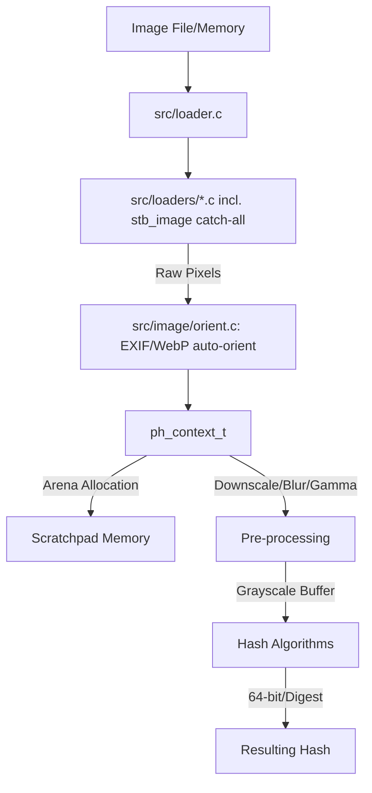

# Architecture Overview

`libphash` is a high-performance C library designed for perceptual image hashing. It prioritizes speed, minimal dependencies, and architectural flexibility.

## Core Components

### 1. Loader Subsystem (`src/loader.c` + `src/loaders/`)

`ph_decode_buffer()` (`src/loader.c`) is the single entry point every format-decoding
path funnels through, both from `ph_load_from_file()` and `ph_load_from_memory()`. It
dispatches across a small table of `{can_read, decode}` pairs (`backends[]`), tried in
order:

1. **Native backends**, each compiled in only when its `PH_USE_*` flag is set:
   `jpeg.c` (libjpeg-turbo/TurboJPEG), `png.c` (libpng *or* spng — mutually exclusive,
   selected at compile time), `webp.c` (libwebp).
2. **`stb_image`** (`src/loaders/stb_image_impl.c`, wrapping the vendored
   `vendor/stb_image.h`) — always registered last, **unconditionally**, not behind any
   `PH_USE_*` flag. It catches anything no native backend claimed, which is what gives
   BMP/GIF/TGA/PSD/HDR/PIC/PNM support for free, and it also covers JPEG/PNG in builds
   without a native decoder for them (the Makefile's portable build has none).

Two formats stb_image does **not** cover: **WebP** (it has no WebP decoder at all —
`ph_decode_buffer()` recognizes WebP's magic bytes and reports
`PH_ERR_DECODER_UNAVAILABLE` when `PH_USE_WEBP` isn't compiled in, rather than letting
stb_image fail with a generic "unknown format") and **TIFF** (unsupported by stb_image
entirely; there is no fallback path for it). Animated GIF is decoded and hashed from
its first frame only; animated WebP is rejected outright (`PH_ERR_CORRUPT_DATA`) by the
native WebP backend rather than decoded to a frame, since that backend uses libwebp's
simple decode API, not the demux API a multi-frame container needs.

**Error codes.** Once a backend's `can_read()` has claimed a buffer, any decode failure
from that point on is a recognized-but-broken bitstream: `PH_ERR_CORRUPT_DATA`. Nothing
recognizing the data at all is `PH_ERR_UNSUPPORTED_FORMAT`. A recognized format with no
compiled-in decoder is `PH_ERR_DECODER_UNAVAILABLE`. Everything about whether the path
itself could be read — missing, unreadable, not a regular file, empty — is decided
before any decoder sees a byte, and is `PH_ERR_IO`. See `include/libphash.h`'s
`ph_error_t` for the full list and `MIGRATION.md` for how these replaced the single,
now-removed `PH_ERR_DECODE_FAILED`.

**EXIF/WebP auto-orientation** (`src/image/orient.c`) runs after a successful decode,
before the pixels reach any hash algorithm, when `ph_context_set_auto_orient()` is
enabled — the default since 2.0.0. It is a narrowly-scoped reader for exactly one TIFF
tag (Orientation, 0x0112) inside IFD0, not a general EXIF/TIFF library, and every read
is bounds-checked since it operates on untrusted file bytes: malformed or absent
metadata degrades silently to orientation 1 ("normal", no transform) rather than
failing the load. See `MIGRATION.md` for why this defaulting to on is a breaking change
for anyone with stored hash values.

**Zero-copy pipeline**: `ph_load_from_file()` memory-maps the file where the platform
allows it, handing decoders direct access to the encoded bytes without a separate
read-into-buffer step.

**Fast grayscale loading**: native decoders can perform grayscale conversion during
decompression (via `ph_context_set_load_grayscale()`), skipping the RGB-to-gray pass
entirely for algorithms that only need luma.

### 2. Image Processing Kernels (`src/image/`)
Optimized low-level primitives for image manipulation, split into dedicated modules:
- **`resize.c`**: box-filter area sampling for downscaling, Mitchell/bilinear filters
  (via the vendored `stb_image_resize2`, `stb_resize_impl.c`) for the rest.
- **`color.c`**: SIMD-accelerated (NEON/SSE) color conversion and grayscale
  transformation using configurable weights (`PH_GRAY_R/G/B`, BT.601-derived — see
  `docs/algorithm-provenance.md`).
- **`filters.c`**: Gaussian blur (sigma-parameterized since 2.0.0 — see
  `docs/algorithms.md`'s Radial section) and Laplacian sharpening.
- **`orient.c`**: the EXIF/WebP auto-orientation layer described above.
- **Gamma Correction**: LUT-based gamma normalization, default 1.0 (identity) since
  2.0.0 — was 2.2 in earlier releases; see `docs/algorithm-provenance.md` §7 for why
  that was a defect specific to the Radial hash, not a general display-gamma setting.

### 3. Hash Algorithms (`src/hashes/`)
Divided into specific implementations corresponding to unique theoretical properties:
- `ahash.c`: Average Hash (frequency-based).
- `phash.c`: DCT-based perceptual hash (robust against moderate scaling/rotation).
- `dhash.c`: Gradient-based hash (extremely fast).
- `mhash.c`: a real Marr-Hildreth hash (Laplacian-of-Gaussian correlation, 576-bit
  digest) since 2.0.0 — see `docs/algorithms.md` for what it replaced.
- `whash.c`: Wavelet-based (DWT Haar) hash supporting fast and full-academic decompositions.
- `bmh.c`: Block Mean Hash, producing a `block_size²`-bit digest (256 bits at the
  default 16×16, up to 1024 bits/128 bytes at the maximum 32×32).
- `radial.c`: variance along projection lines through the centre, standardized and
  reduced by a 1-D DCT to 40 quantized coefficients.
- `color_histogram.c`: ColorHash — a 108-bin opponent-colour-space histogram, compared
  by histogram intersection, not a bit vector.
- `color_moments.c`: mean/std-dev/skew of each RGB channel as nine signed fixed-point
  features.
- `multi.c`: `ph_compute_multi()`'s shared-grayscale batching of the four `uint64_t`
  algorithms (aHash/dHash/pHash/wHash) in one call.
- `common.c`: bit-packing/statistics helpers shared by several of the above.

Every one of these is traced to its primary source, and every known divergence from
that source is written down, in `docs/algorithm-provenance.md` — this page describes
where the code lives, not what it computes or why; see `docs/algorithms.md` for that.

## Data Flow

## Key Structures

### `ph_context_t`
The central opaque object designed for high-load environments. Thread-safety is
per-context, not global: distinct threads each using their own `ph_context_t` need no
synchronization between them, but a single instance is not safe to share between
threads (see the `@note` on the typedef in `include/libphash.h`). `ph_hash_files()`/
`ph_hash_buffers()` follow this same rule internally — each worker thread in their pool
creates and owns its own context. `ph_context_t` is internally organized into logical
groups:
- **`image`**: Loaded pixel data, dimensions, and caching for grayscale buffers.
- **`config`**: User-defined parameters (Gamma, DCT size, block size, custom weights, auto-orient, max pixels, decode scale, etc.) — see `include/libphash.h`'s `ph_context_set_*` family, all of which return `ph_error_t` and reject an invalid argument rather than clamping or ignoring it (see `MIGRATION.md`).
- **`arena`**: An internal **Arena Allocator** providing a contiguous scratchpad for zero-fragmentation, high-speed memory operations during image processing and hash computation.

### `ph_digest_t`

For algorithms whose output doesn't fit a `uint64_t` (mHash, BMH, Radial, ColorHash,
ColorMoments), a flat, FFI-safe struct: up to `PH_DIGEST_MAX_BYTES` (128) bytes of
digest data, a `size`, and a `kind` tag (`ph_digest_kind_t`) saying what the bytes mean
— a bit vector, quantized transform coefficients, a real-valued feature vector, or a
histogram — so that a comparison function meant for one kind can refuse the others
instead of returning a number that looks plausible and means nothing. See
`include/libphash.h`'s comparison-functions section and `MIGRATION.md` for the full
contract.

## Lifecycle, introspection and loading without a decoder

- `ph_create()`/`ph_free()` — allocate/release a `ph_context_t`. `ph_create()` is
  `PH_NODISCARD`; check its return before using the context.
- `ph_version()`/`ph_version_number()` — the library version as a string or a single
  comparable integer (see `MIGRATION.md` for the 2.0.0 numbering-scheme change).
- `ph_can_use_libjpeg()`/`ph_can_use_libpng()`/`ph_can_use_webp()` — whether this build
  was compiled with the corresponding native decoder, for a caller that wants to know
  without triggering a `PH_ERR_DECODER_UNAVAILABLE` first.
- `ph_is_loaded()`/`ph_context_get_dimensions()` — whether an image is currently loaded
  on a context, and its width/height/channel count.
- `ph_get_last_error_message(ctx)` — a short diagnostic string for the most recent
  failure on that context (e.g. the decoder-reported reason a load failed), beyond what
  the `ph_error_t` code alone says. Not thread-safe to read concurrently with a load
  call on the same context.
- `ph_context_set_gray_weights(r, g, b)` — override the default BT.601-derived
  grayscale weights (see `docs/algorithm-provenance.md`) for callers whose images
  aren't sRGB photographs.
- `ph_context_set_decode_scale()` — opt into decoding a JPEG at 1/2, 1/4 or 1/8 linear
  resolution via libjpeg-turbo's DCT-domain scaling, trading accuracy for decode speed.
  JPEG only; PNG has no format-level scaled decode and libwebp's scaling API resizes
  *after* a full decode, so both backends ignore it. Default is full resolution —
  behavior and golden hashes are unchanged unless a caller sets this explicitly.
- `ph_load_from_pixels()` — the one entry point that bypasses the loader subsystem
  entirely: hands the context a raw pixel buffer (already decoded by the caller, or
  synthetic) instead of encoded bytes. No format to detect, no decoder involved, and
  therefore none of `ph_error_t`'s format-related codes apply — see its doc comment in
  `include/libphash.h` for the exact contract on `width`/`height`/`channels`/`stride`.
