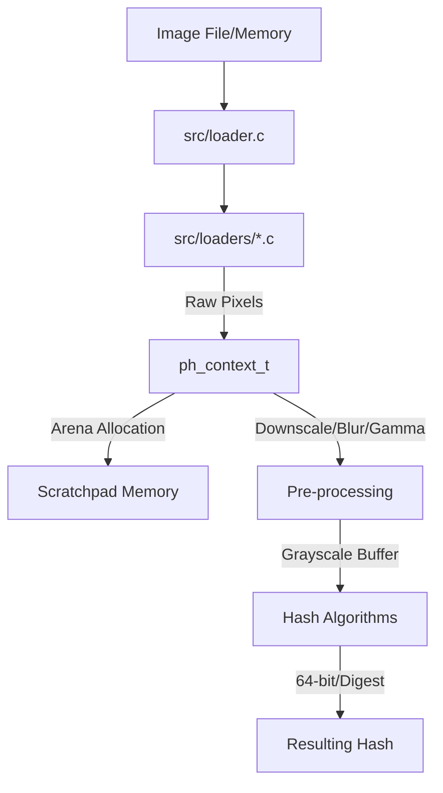

# Architecture Overview

`libphash` is a high-performance C library designed for perceptual image hashing. It prioritizes speed, minimal dependencies, and architectural flexibility.

## Core Components

### 1. Loader Subsystem (`src/loaders/`)
Handles image decoding from files and memory buffers through a unified dispatcher (`src/loader.c`).
- **Backends**: Dedicated implementations for `jpeg.c` (libjpeg-turbo), `png.c` (libpng/spng), and `webp.c` (libwebp).
- **Unified Interface**: `ph_decode_buffer` provides a single entry point for all supported formats, automatically detecting the image type based on magic numbers.
- **Zero-Copy Pipeline**: Uses memory-mapping (`mmap`) in `ph_load_from_file` to provide decoders with direct access to file data, minimizing context switches and redundant heap allocations.
- **Fast Grayscale**: Decoders can perform grayscale conversion natively during decompression (via `ph_context_set_load_grayscale`), bypassing the RGB-to-gray pass for significant performance gains in grayscale-only algorithms.

### 2. Image Processing Kernels (`src/image/`)
Optimized low-level primitives for image manipulation, split into dedicated modules:
- **`resize.c`**: Implements area sampling (box filter) for high-quality downscaling and bilinear interpolation for upscaling.
- **`color.c`**: SIMD-accelerated (NEON/SSE) color conversion and grayscale transformation using configurable weights.
- **`filters.c`**: 3x3 Gaussian blur for noise reduction and Laplacian sharpening for edge preservation.
- **Gamma Correction**: Fast, LUT-based gamma normalization (default 2.2).

### 3. Hash Algorithms (`src/hashes/`)
Divided into specific implementations corresponding to unique theoretical properties:
- `ahash.c`: Average Hash (frequency-based).
- `phash.c`: DCT-based perceptual hash (robust against moderate scaling/rotation).
- `dhash.c`: Gradient-based hash (extremely fast).
- `mhash.c`: Marr-Hildreth or structured block-based logical grid approach.
- `whash.c`: Wavelet-based (DWT Haar) hash supporting fast and full-academic decompositions.
- `bmh.c`: Block Mean Hash, producing high-resolution (256-bit) digest fingerprints.
- `radial.c`: Rotationally invariant spatial sampling.
- `color_moments.c`: Statistical distribution of colors for distinguishing color-unique identical geometry.

## Data Flow

## Key Structures

### `ph_context_t`
The central opaque object designed for thread-safety and high-load environments. It is internally organized into logical groups:
- **`image`**: Loaded pixel data, dimensions, and caching for grayscale buffers.
- **`config`**: User-defined parameters (Gamma, DCT size, block size, custom weights, etc.).
- **`arena`**: An internal **Arena Allocator** providing a contiguous scratchpad for zero-fragmentation, high-speed memory operations during image processing and hash computation.
