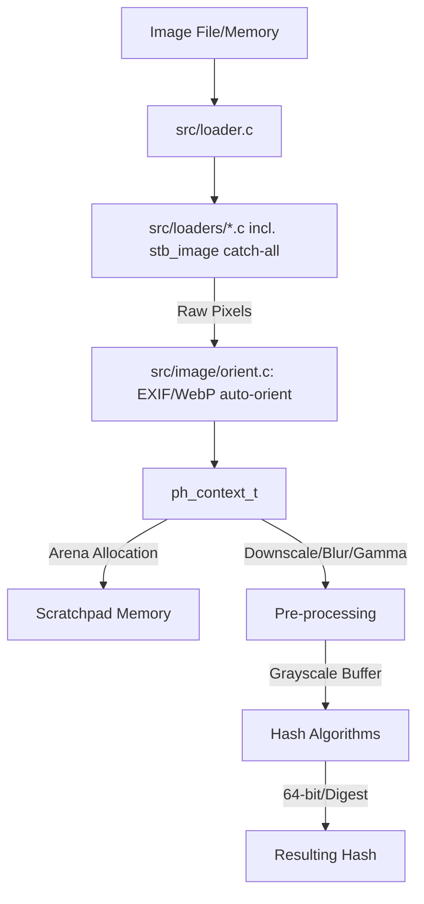

# Architecture Overview

`libphash` is a high-performance C library designed for perceptual image hashing. It prioritizes speed, minimal dependencies, and architectural flexibility.

## Core Components

### 1. Loader Subsystem (`src/loader.c` + `src/loaders/`)

`ph_decode_buffer()` (`src/loader.c`) is the single entry point every format-decoding
path funnels through, both from `ph_load_from_file()` and `ph_load_from_memory()`. It
dispatches across a small table of `{can_read, decode}` pairs (`backends[]`), tried in
order:

1. **Native backends**, each compiled in only when its `PH_USE_*` flag is set:
   `jpeg.c` (libjpeg-turbo, libjpeg API), `png_libpng.c` (libpng), `webp.c`
   (libwebp).
2. **`stb_image`** (`src/loaders/stb_image_impl.c`, wrapping the vendored
   `vendor/stb_image.h`) — always registered last, **unconditionally**, not behind any
   `PH_USE_*` flag. It catches anything no native backend claimed, which is what gives
   BMP/GIF/TGA/PSD/HDR/PIC/PNM support for free, and it also covers JPEG/PNG in builds
   without a native decoder for them (the Makefile's portable build has none).

Two formats stb_image does **not** cover: **WebP** (it has no WebP decoder at all —
`ph_decode_buffer()` recognizes WebP's magic bytes and reports
`PH_ERR_DECODER_UNAVAILABLE` when `PH_USE_WEBP` isn't compiled in, rather than letting
stb_image fail with a generic "unknown format") and **TIFF** (unsupported by stb_image
entirely; there is no fallback path for it). Animated GIF is decoded and hashed from
its first frame only; animated WebP is rejected outright (`PH_ERR_CORRUPT_DATA`) by the
native WebP backend rather than decoded to a frame, since that backend uses libwebp's
simple decode API, not the demux API a multi-frame container needs.

**Error codes.** Once a backend's `can_read()` has claimed a buffer, any decode failure
from that point on is a recognized-but-broken bitstream: `PH_ERR_CORRUPT_DATA`. Nothing
recognizing the data at all is `PH_ERR_UNSUPPORTED_FORMAT`. A recognized format with no
compiled-in decoder is `PH_ERR_DECODER_UNAVAILABLE`. Everything about whether the path
itself could be read — missing, unreadable, not a regular file, empty — is decided
before any decoder sees a byte, and is `PH_ERR_IO`
([Where a load fails](guide/errors.md#where-a-load-fails)).

**EXIF/WebP auto-orientation** (`src/image/orient.c`) runs after a successful decode,
before the pixels reach any hash algorithm, when `ph_context_set_auto_orient()` is
enabled — on by default. It is a narrowly-scoped reader for exactly one TIFF
tag (Orientation, 0x0112) inside IFD0, not a general EXIF/TIFF library, and every read
is bounds-checked since it operates on untrusted file bytes: malformed or absent
metadata degrades silently to orientation 1 ("normal", no transform) rather than
failing the load. An image with a rotating tag therefore hashes as displayed, not as
stored; see `MIGRATION.md` for what that means for stored hash values.

**Zero-copy pipeline**: `ph_load_from_file()` memory-maps the file where the platform
allows it, handing decoders direct access to the encoded bytes without a separate
read-into-buffer step.

**Fast grayscale loading**: native decoders can perform grayscale conversion during
decompression (via `ph_context_set_load_grayscale()`), skipping the RGB-to-gray pass
entirely for algorithms that only need luma.

### 2. Image Processing Kernels (`src/image/`)
Optimized low-level primitives for image manipulation, split into dedicated modules:
- **`resize.c`**: the exact area average (`ph_area_downscale()`, with the context's cached
  32×32 grid of area sums), box-filter sampling, Mitchell/bilinear filters
  (via the vendored `stb_image_resize2`, `stb_resize_impl.c`) for the rest.
- **`color.c`**: color conversion (NEON-accelerated on Arm) and grayscale
  transformation using configurable weights (`PH_GRAY_R/G/B`, BT.601-derived — see
  `docs/algorithm-provenance.md`).
- **`filters.c`**: Gaussian blur (σ-parameterized; mHash and Radial, see
  `docs/theory/mhash.md` and `docs/theory/radial.md`) and histogram equalization (mHash).
- **`orient.c`**: the EXIF/WebP auto-orientation layer described above.
- **Gamma Correction** (in `color.c`): `(v/max)^γ · max` per image, default γ = 1.0
  (identity), Radial only; see `docs/algorithm-provenance.md` §7.

### 3. Hash Algorithms (`src/hashes/`)
Divided into specific implementations corresponding to unique theoretical properties:
- `ahash.c`: Average Hash (mean threshold on an 8×8 reduction).
- `phash.c`: DCT-based perceptual hash (robust to scaling and moderate compression).
- `dhash.c`: Gradient-based hash (extremely fast).
- `mhash.c`: Marr–Hildreth hash (Laplacian-of-Gaussian correlation, 576-bit digest).
- `whash.c`: Wavelet-based (DWT Haar) hash, in fast (fixed 16×16) and full (power-of-two
  cascade) modes.
- `bmh.c`: Block Mean Hash, producing a `block_size²`-bit digest (256 bits at the
  default 16×16, up to 1024 bits/128 bytes at the maximum 32×32).
- `radial.c`: variance along projection lines through the center, standardized and
  reduced by a 1-D DCT to 40 quantized coefficients.
- `color_histogram.c`: ColorHash — a 108-bin opponent-color-space histogram, compared
  by histogram intersection, not a bit vector.
- `color_moments.c`: mean/std-dev/skew of each RGB channel as nine signed fixed-point
  features.
- `algorithm.c`: algorithms as values — the `ph_algorithm_t` dispatcher, each
  algorithm's digest shape and its name (see "Algorithms as values" below).
- `multi.c`: `ph_compute_multi()`, the four `uint64_t` algorithms (aHash/dHash/pHash/wHash)
  in one call, over the context's cached grayscale and shared area-average pass.
- `common.c`: the median threshold pHash and wHash share (`ph_median_bitpack*`).

Comparison and serialization of finished digests (`ph_hamming_distance*`,
`ph_similarity*`, `ph_l2_distance`, `ph_radial_similarity`, the hex helpers) live in
`src/compare.c`, outside the algorithms directory.

Every algorithm is traced to its source (or, for wHash, to the absence of one), and
every known divergence from
that source is written down, in `docs/algorithm-provenance.md` — this page describes
where the code lives, not what it computes or why; the algorithm pages under `docs/theory/` cover that.

### 4. Context, files and the shared core (`src/*.c`)

- `core.c`: the context lifecycle (`ph_create()`, `ph_free()`), the error strings and
  `ph_get_last_error_message()`, and the load entry points (`ph_load_from_file()`,
  `ph_load_from_memory()`, `ph_load_from_pixels()`) — decode, alpha handling and
  orientation in that order.
- `config.c`: the `ph_context_set_*` setters and the defaults a new context starts from.
- `arena.c`: the scratch arena (see "Key Structures"); its fields are touched only here.
- `fileio.c`: a file's bytes from exactly one `open()`, memory-mapped where the platform
  allows it and read into the heap otherwise; every reason a path cannot be loaded is
  classified here as `PH_ERR_IO`, before a decoder sees a byte.
- `batch.c`: `ph_hash_files()`/`ph_hash_buffers()` and their `_ex` forms, the worker
  pool and the CPU count behind `threads = 0` (see [`batch.md`](batch.md)).
- `compare.c`: comparison and hex serialization of finished digests.
- `version.c`: `ph_version()`, `ph_version_number()`, `ph_get_build_info()` and the
  `ph_can_use_*()` queries.

There is no catch-all internal header. Each subsystem has its own, included by path
from `src/`: `context.h` (`struct ph_context` and its configuration), `arena.h`,
`safety.h` (decode limits, overflow-checked allocation sizes, diagnostic messages),
`bytes.h` (byte-order loads), `digest.h` (digest checks shared by the comparison
functions), `batch.h`, `fileio.h`, `loader.h`, `image/image.h`, `hashes/hashes.h` (the
algorithms' shared math and every algorithm constant) and `loaders/backends.h`.

## Data Flow

```mermaid
graph TD
    File[Image File/Memory] --> Dispatcher[src/loader.c]
    Dispatcher --> Backends[src/loaders/*.c incl. stb_image catch-all]
    Backends -->|Raw Pixels| Orient[src/image/orient.c: EXIF/WebP auto-orient]
    Orient --> Context[ph_context_t]
    Context -->|Arena Allocation| Scratch[Scratchpad Memory]
    Context -->|Downscale/Blur/Gamma| Preproc[Pre-processing]
    Preproc -->|Grayscale Buffer| Algos[Hash Algorithms]
    Algos -->|64-bit/Digest| Output[Resulting Hash]
```

## Key Structures

### `ph_context_t`
The central opaque object designed for high-load environments. Thread-safety is
per-context, not global: distinct threads each using their own `ph_context_t` need no
synchronization between them, but a single instance is not safe to share between
threads (see the `@note` on the typedef in `include/libphash.h`). `ph_hash_files()`/
`ph_hash_buffers()` follow this same rule internally — each worker thread in their pool
creates and owns its own context. `ph_context_t` is internally organized into logical
groups:
- **`image`**: Loaded pixel data, dimensions, and caching for grayscale buffers.
- **`config`**: User-defined parameters (Gamma, DCT size, block size, custom weights, auto-orient, max pixels, decode scale, etc.) — see `include/libphash.h`'s `ph_context_set_*` family, all of which return `ph_error_t` and reject an invalid argument rather than clamping or ignoring it (see `MIGRATION.md`).
- **`arena`**: An internal **Arena Allocator** providing a contiguous scratchpad for zero-fragmentation, high-speed memory operations during image processing and hash computation.

### `ph_digest_t`

For algorithms whose output doesn't fit a `uint64_t` (mHash, BMH, Radial, ColorHash,
ColorMoments), a flat, FFI-safe struct: up to `PH_DIGEST_MAX_BYTES` (128) bytes of
digest data, a `size`, and a `kind` tag (`ph_digest_kind_t`) saying what the bytes mean
— a bit vector, quantized transform coefficients, a real-valued feature vector, or a
histogram — so that a comparison function meant for one kind can refuse the others
instead of returning a number that looks plausible and means nothing. See
`include/libphash.h`'s comparison-functions section and `MIGRATION.md` for the full
contract.

## Lifecycle, introspection and loading without a decoder

- `ph_create()`/`ph_free()` — allocate/release a `ph_context_t`. `ph_create()` is
  `PH_NODISCARD`; check its return before using the context.
- `ph_version()`/`ph_version_number()` — the library version as a string or a single
  comparable integer (major×1000000 + minor×1000 + patch).
- `ph_can_use_jpeg()`/`ph_can_use_png()`/`ph_can_use_webp()` — whether this build
  was compiled with the corresponding native decoder, for a caller that wants to know
  without triggering a `PH_ERR_DECODER_UNAVAILABLE` first.
- `ph_get_build_info()` — one line describing the build (`version=… jpeg=… png=… webp=…
  zlib=… threads=… simd=… mock=…`), for logs and bug reports; it also tells whether a batch can use
  threads at all.
- `ph_is_loaded()`/`ph_context_get_dimensions()` — whether an image is currently loaded
  on a context, and its width/height/channel count.
- `ph_get_last_error_message(ctx)` — the detail of the last load on that context when it
  failed (the path and the system's reason, the decoder's complaint), beyond what the
  `ph_error_t` code alone says ([Handling errors](guide/errors.md#the-detail-of-a-failed-load)).
- `ph_context_set_gray_weights(r, g, b)` — override the default BT.601-derived
  grayscale weights (see `docs/algorithm-provenance.md`) for callers whose images
  aren't sRGB photographs. The weights are normalized to sum to 128;
  `ph_context_get_gray_weights()` reads back the values actually stored.
- `ph_context_set_decode_scale()` — opt into decoding a JPEG at 1/2, 1/4 or 1/8 linear
  resolution via libjpeg-turbo's DCT-domain scaling, trading accuracy for decode speed.
  JPEG only; PNG has no format-level scaled decode and libwebp's scaling API resizes
  *after* a full decode, so both backends ignore it. Default is full resolution —
  behavior and golden hashes are unchanged unless a caller sets this explicitly.
- `ph_load_from_pixels()` — the one entry point that bypasses the loader subsystem
  entirely: hands the context a raw pixel buffer (already decoded by the caller, or
  synthetic) instead of encoded bytes. No format to detect, no decoder involved, and
  therefore none of `ph_error_t`'s format-related codes apply — see its doc comment in
  `include/libphash.h` for the exact contract on `width`/`height`/`channels`/`stride`.

## Error codes

Every function that can fail returns a `ph_error_t`. What each code means, which step of a
load returns it and what a caller does about it: [Handling errors](guide/errors.md).

## Batch hashing

`ph_hash_files()`/`ph_hash_buffers()` and their `_ex` forms (`src/batch.c`) run many
images through a pool of worker threads, each worker with a context of its own. How to
use them, what they guarantee about threads and memory, and what an item costs:
[`batch.md`](batch.md).

## Algorithms as values

For code that chooses the algorithm at run time — a binding, a configuration file, a
column in a database — every algorithm is also a `ph_algorithm_t` value, contiguous from
0 to `PH_ALGORITHM_COUNT - 1`:

- `ph_compute_digest(ctx, algo, &digest)` computes any of them into a `ph_digest_t`. The
  four `uint64_t` algorithms come back as 8-byte `bits` digests, most significant byte
  first, so every algorithm can be stored and compared through the digest functions alone.
- `ph_digest_info(ctx, algo, &size, &kind)` says what that digest will be without an image
  (`ctx` may be NULL for the defaults). Only BMH's size depends on the configuration.
- `ph_algorithm_name()`/`ph_algorithm_from_name()` convert to and from the stable names
  (`"ahash"`, …, `"color_moments"`).

A digest's size and kind are decided in one place, `ph_digest_shape()` in
`src/hashes/algorithm.c`: every `ph_compute_*` that returns a digest takes them from it,
and `ph_digest_info()` reports it, so the two cannot drift; `tests/src/test_algorithms.c`
checks every algorithm, and BMH at every block size, against an actual computation. For the
`uint64_t` algorithms the `ph_hash_flags_t` bit is `1 << ph_algorithm_t value`.
