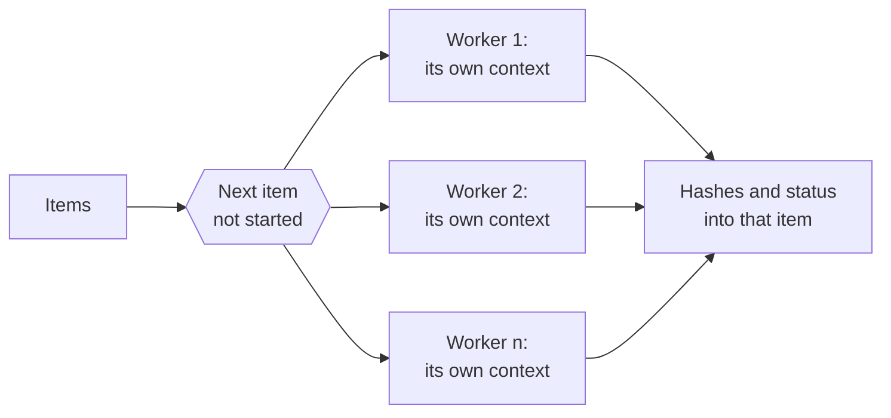

# Hashing many files

A collection of images is hashed one image at a time, and the images are independent of
each other: the work divides across threads with nothing to share.
[`ph_hash_files()`](../api/batch.md#ph_hash_files) and
[`ph_hash_buffers()`](../api/batch.md#ph_hash_buffers) take an array of files or encoded
buffers and hash them on a pool of worker threads. This page shows a batch in code, what
the plain call decides for you and how the `_ex` variants change it, how to read the
results, how many workers to run, measured, and what they hold in memory.

## A batch in one call

A batch is an array of items. Each item names its input, a path for
[`ph_batch_item_t`](../api/batch.md#ph_batch_item_t) and a pointer and a length for
[`ph_batch_buffer_item_t`](../api/batch.md#ph_batch_buffer_item_t), and receives the hashes
and a status. The flags choose among the four 64-bit hashes, aHash, dHash, pHash and wHash,
and each item's `hashes` holds one value per flag in ascending bit order, as
[`ph_compute_multi()`](../api/hash64.md#ph_compute_multi) writes them:

```c title="examples/batch_hash.c"
--8<-- "examples/batch_hash.c:items"
```

The array has room for [`PH_BATCH_HASHES_CAPACITY`](../api/batch.md#PH_BATCH_HASHES_CAPACITY)
values, more than the four algorithms need, so that a fifth 64-bit algorithm would not
change the size of an item.

The plain call takes the items, their number, the flags and a thread count, and returns
when every item is done:

```c title="examples/batch_hash.c"
--8<-- "examples/batch_hash.c:plain"
```

Each worker creates a context of its own, takes the next item no worker has started, loads
it with [`ph_load_from_file()`](../api/loading.md#ph_load_from_file) (or
[`ph_load_from_memory()`](../api/loading.md#ph_load_from_memory)), computes the hashes with
`ph_compute_multi()`, and writes the result into that item and nowhere else. A failure stays
in the item's `status` and the next item is taken as usual:



`ph_hash_buffers()` works the same on encoded bytes already in memory, such as downloaded
files; the buffers stay the caller's and are not copied.

## A configuration, progress and cancellation

The plain call decides three things for you:

- **The default configuration.** Every item is hashed as by a freshly created context:
  nothing set with a `ph_context_set_*()` function anywhere applies, the default
  [size limit](loading.md#untrusted-and-large-images) included. For a file whose context
  you configured, the batch and a single load give different hashes.
- **No progress and no stop.** The call returns after the last item and reports nothing on
  the way.
- **A worker per CPU, when `threads` is 0**, each holding an image ([Memory](#memory)).

[`ph_hash_files_ex()`](../api/batch.md#ph_hash_files_ex) and
[`ph_hash_buffers_ex()`](../api/batch.md#ph_hash_buffers_ex) take the same items and flags
and a [`ph_batch_options_t`](../api/batch.md#ph_batch_options_t), filled with its defaults by
[`ph_batch_options_init()`](../api/batch.md#ph_batch_options_init) and then changed where
needed:

```c title="examples/batch_hash.c"
--8<-- "examples/batch_hash.c:options"
```

- **`config`** is a template context. Everything set on it is copied into every worker's
  context, on the calling thread, before any worker starts, so each item is hashed exactly
  as a load and `ph_compute_multi()` on the template would hash it. An image loaded on the
  template is ignored. Of the hash settings, a batch reads the grayscale weights and the
  pHash and wHash parameters, the ones its four hashes use
  ([Configuring a context](configuring.md#the-same-settings-everywhere)).
- **`threads`** is the worker count, as in the plain call ([How many workers](#how-many-workers)).
- **`should_continue`** is called before each item. Once it returns 0, no worker starts
  another item, the items in progress finish, and every item not started gets
  [`PH_ERR_CANCELLED`](../api/errors.md#PH_ERR_CANCELLED). It may still be called a few
  times by workers that had not yet seen the stop.
- **`on_progress`** is called after each finished item, successful or not, with the number
  of items finished so far and the size of the batch. Each count from 1 up is passed once,
  but not necessarily in order; items a cancellation skipped are not counted.
- **`user_data`** is passed to both callbacks unchanged.

Both callbacks run on the worker threads, several at a time, so each must be safe to call
from two threads at once. The example's need no lock: one reads an atomic flag that Ctrl-C
sets, the other writes a line built from its arguments.

```c title="examples/batch_hash.c"
--8<-- "examples/batch_hash.c:callbacks"
```

## Reading the results

The call's return value says whether the batch was worked on; how each image went is in its
item. A batch that returns [`PH_SUCCESS`](../api/errors.md#PH_SUCCESS) may have every item
failed, and a cancelled batch has real results in the items it started:

```c title="examples/batch_hash.c"
--8<-- "examples/batch_hash.c:statuses"
```

An item's `hashes` are valid only when its `status` is `PH_SUCCESS`. What each return
value means for the items, and how to get the detail of a failed item, is in [Errors in a
batch](errors.md#errors-in-a-batch).

## How many workers

`threads` sets the size of the pool:

| `threads` | Workers |
|---|---|
| 1 | none: every item runs on the calling thread, and no thread is created |
| more than 1 | that many, and never more than there are items |
| 0 | one per CPU this process may use |

What "may use" means depends on the system. On Linux it is the online CPUs, narrowed by the
process's affinity mask (`taskset`, `docker --cpuset-cpus`) and by a cgroup v1 or v2 CPU
quota rounded up (`docker --cpus`, a Kubernetes CPU limit), so a container limited to two
CPUs gets two workers. On macOS it is the online CPUs. On Windows it is the process's
affinity mask within its processor group, which Windows caps at 64 logical processors, so
`threads = 0` starts at most 64 workers. Starting more would not help: a thread runs in the
processor group of the thread that created it, and the extra workers would share the same
64 processors. On a machine with more than 64, pass the count and place the threads in
groups yourself.

A library built without `PHASH_ENABLE_THREADS` runs every batch on the calling thread,
whatever `threads` says; [`ph_get_build_info()`](../api/build.md#ph_get_build_info) reports
`threads=on` or `threads=off`.

Throughput grows with the workers up to one per CPU and levels off there. Each worker adds
less than one worker's rate, by an amount that depends on the machine, and past one per CPU
the workers take turns on the same CPUs: the batch gets little or no faster, and holds one
more image per worker:


--8<-- "docs/assets/generated/batch/scaling.md"
Small images and large ones scale alike. `threads = 0` is the fastest setting where the
batch has the machine to itself; where several batches or other work run at once, their
workers add up, and each should be given its share explicitly.

??? info "The numbers behind the chart"

    --8<-- "docs/assets/generated/batch/scaling-table.md"

??? info "How this was measured"

    `site_stages batch` hashes a batch whose items all name one file, with the four 64-bit
    hashes, and reports the shortest run and the peak resident memory of its process. The
    peak is a high-water mark of the whole process, so each worker count runs as a process
    of its own. The file is the large example photograph at 20 megapixels and at a quarter
    of one, as JPEG. Below is the code that ran, not a copy of it.

    ```python title="tools/site/measure/timing.py"
    --8<-- "tools/site/measure/timing.py:batch"
    ```

    ```c title="tools/site/stages/timing.c"
    --8<-- "tools/site/stages/timing.c:batch"
    ```

    ```sh
    cmake --preset release && cmake --build --preset release --target site_stages
    build/release/site_stages batch photo.jpeg 4 44 5
    ```

## Memory

A worker holds one image at a time. While an item is loaded and hashed, that is its decoded
pixels, 3 bytes each, their grayscale copy, 1 byte each, and the encoded file, mapped or
read while it is decoded. The previous item's image is freed before the next load. A
worker's share of the peak is about four bytes per pixel plus the file, as measured:

--8<-- "docs/assets/generated/batch/memory.md"

The peak of a batch is therefore about the number of workers times four bytes per pixel of
its largest images, and grows by the same amount for every worker added, past one per CPU
as well. An image with an EXIF orientation other than upright holds a second copy of its
pixels while it is turned, 6 bytes per pixel for that moment. A buffer batch holds no file
per worker, since the buffers are the caller's.

The bound that matters is the largest image the batch may meet. At the default size limit of
256 Mi pixels, one worker may hold about 1 GiB, and `threads = 0` on a machine with 64 CPUs
may hold 64 GiB. Three settings lower it:

- **An explicit thread count**, which bounds the number of images held at once.
- **A lower size limit** on the template
  ([`ph_context_set_max_pixels()`](../api/loading.md#ph_context_set_max_pixels)), which
  refuses a larger image with [`PH_ERR_IMAGE_TOO_LARGE`](../api/errors.md#PH_ERR_IMAGE_TOO_LARGE)
  before its pixels are allocated.
- **A reduced decode scale** on the template
  ([`ph_context_set_decode_scale()`](../api/loading.md#ph_context_set_decode_scale)): a JPEG
  decoded at ½ of its width and height holds a quarter of its pixels. It changes the hashes
  ([Decoding at a reduced scale](../theory/preparation.md#decoding-at-a-reduced-scale)).

??? info "How the estimate is computed"

    ```python title="tools/site/pages/batch.py"
    --8<-- "tools/site/pages/batch.py:estimate"
    ```

## What an item costs

An item costs its load and its hashes, and both grow with the pixels of the source image,
not with the size of the hash; [Performance](performance.md#where-the-time-goes) has the
times by image size and format, and
[Choosing an algorithm](../theory/choosing.md#cost) by algorithm. Two settings on the
template make every item cheaper:

- **A reduced decode scale**, for JPEG, as above.
- **Loading as grayscale**
  ([`ph_context_set_load_grayscale()`](../api/loading.md#ph_context_set_load_grayscale)):
  the four hashes a batch computes are grayscale hashes, so a batch never needs the color.
  It can move a hash, as the decoder's grayscale differs from the library's
  ([Loading as grayscale](loading.md#loading-as-grayscale)).

[Making it cheaper](performance.md#making-it-cheaper) has what each saves on a 20-megapixel
JPEG. A single image is never split across threads; the reason is in
[One image, one thread](performance.md#one-image-one-thread).

## Threads: what is safe

- **One context per thread.** The library is safe to call from any number of threads at once
  as long as each thread uses its own [`ph_context_t`](../api/context.md#ph_context_t). One
  context shared between threads is not safe, not even for two threads that only read it.
  A batch follows the same rule: each worker owns its context.
- **Batch calls take no context**, so several threads may each run a batch at the same time.
  Each call starts its own pool, so their worker counts add up.
- **The template** is read once, on the calling thread, before any worker starts. Another
  thread must not change it while a batch call is starting.
- **The callbacks** run on the worker threads, several at a time.

## In code

The example hashes the files on its command line with dHash and pHash. Without arguments
besides the files, it uses `ph_hash_files_ex()` with a template that decodes JPEGs at half
size, four workers, a progress line per file and Ctrl-C to stop; with `--defaults`, the plain
`ph_hash_files()`. A JPEG hashes differently the two ways, since half the pixels make
another image.

```c title="examples/batch_hash.c"
--8<-- "examples/batch_hash.c"
```

--8<-- "docs/assets/generated/timing/footnote.md"
