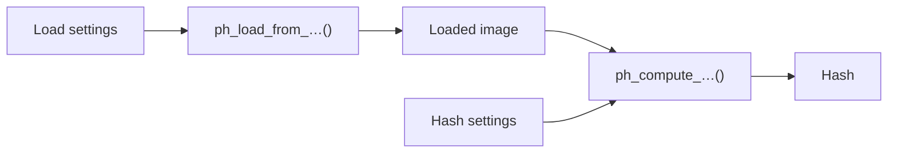

# Configuring a context

A context carries its settings next to the image: thirteen `ph_context_set_*()`
functions, each with a default that a freshly created context already has. This page lists
all of them, says when each one is read, which ones change the value of a hash, and how to
give every context in a program, and every worker of a batch, the same configuration. What
a setting does to a particular hash, measured, is on that algorithm's page.

## Every setting

Eight settings are read by the hash, and only the algorithms they name read them.

| Setter | Sets | Accepted | Default |
|---|---|---|---|
| [`ph_context_set_gray_weights()`](../api/params.md#ph_context_set_gray_weights) | the weights of R, G and B in the [grayscale](../theory/preparation.md#grayscale) of aHash, dHash, pHash, wHash, mHash, BMH and Radial | each ≥ 0, sum 1 … 8 421 504 | 38, 75, 15 |
| [`ph_context_set_gamma()`](../api/params.md#ph_context_set_gamma) | Radial's [gamma](../theory/radial.md#gamma), and nothing else's | finite, (0.001, 1000] | 1, the step skipped |
| [`ph_context_set_phash_params()`](../api/params.md#ph_context_set_phash_params) | pHash's [DCT grid and block of coefficients](../theory/phash.md#parameters) | `dct_size` from `reduction_size` to 32; `reduction_size` 4 … 8 | 32, 8 |
| [`ph_context_set_whash_mode()`](../api/params.md#ph_context_set_whash_mode) | wHash's [mode](../theory/whash.md#the-full-mode) | `PH_WHASH_FAST`, `PH_WHASH_FULL` | `PH_WHASH_FAST` |
| [`ph_context_set_whash_remove_max_haar_ll()`](../api/params.md#ph_context_set_whash_remove_max_haar_ll) | wHash's [removal of the coarsest LL band](../theory/whash.md#remove_max_haar_ll) | any `int`; non-zero is on | off |
| [`ph_context_set_mhash_params()`](../api/params.md#ph_context_set_mhash_params) | mHash's [kernel scale and normalized size](../theory/mhash.md#parameters) | `alpha` > 1, `level` ≥ 0, a kernel of at most 65 on a side; `size` 62 … 4096 | 2, 1, 512 |
| [`ph_context_set_block_params()`](../api/params.md#ph_context_set_block_params) | BMH's [grid](../theory/bmh.md#block_size), and with it the digest's size | 2 … 32 | 16 |
| [`ph_context_set_radial_params()`](../api/params.md#ph_context_set_radial_params) | Radial's [projections, samples and blur](../theory/radial.md#parameters) | 40 … 4096, 2 … 4096, σ in (0, 64/3] | 180, 128, 3.5 |

Five are read by the load, and reach every algorithm through the image they load.

| Setter | Sets | Accepted | Default |
|---|---|---|---|
| [`ph_context_set_load_grayscale()`](../api/loading.md#ph_context_set_load_grayscale) | [one channel](loading.md#loading-as-grayscale) from the decoder instead of color; ColorHash and ColorMoments refuse such an image | any `int`; non-zero is on | off |
| [`ph_context_set_alpha_mode()`](../api/loading.md#ph_context_set_alpha_mode) | the [background](../theory/preparation.md#transparency) of an image with alpha | the four `ph_alpha_mode_t` values | `PH_ALPHA_BLEND_GREY` |
| [`ph_context_set_auto_orient()`](../api/loading.md#ph_context_set_auto_orient) | applying the [EXIF orientation](../theory/preparation.md#orientation) | any `int`; non-zero is on | on |
| [`ph_context_set_decode_scale()`](../api/loading.md#ph_context_set_decode_scale) | [decoding a JPEG](../theory/preparation.md#decoding-at-a-reduced-scale) at 1/2, 1/4 or 1/8 of its size | the four `ph_decode_scale_t` values | `PH_DECODE_SCALE_FULL` |
| [`ph_context_set_max_pixels()`](../api/loading.md#ph_context_set_max_pixels) | the [largest image](loading.md#untrusted-and-large-images) a load accepts | any `uint64_t`; 0 is no limit of its own | 256 × 1024 × 1024 |

ColorHash and ColorMoments have no parameters, so only the load settings reach them.
[Loading images](loading.md#settings-that-shape-the-image) says when to change each of
the five.

## When a setting is read



**A hash setting is read by the next hash.** The image already loaded is hashed again with
the new value, without a reload. The grayscale weights are one of these: setting them
drops the grayscale cached from the loaded image, and the next hash converts it again.

**A load setting is read by the next load.** The image in the context keeps what it was
loaded with: grayscale loading switched on after a color load leaves the color image, and
ColorHash still works on it until the next load replaces it.

## A refused value changes nothing

Every setter returns [`PH_SUCCESS`](../api/errors.md#PH_SUCCESS) for a value in range and
[`PH_ERR_INVALID_ARGUMENT`](../api/errors.md#PH_ERR_INVALID_ARGUMENT) for anything else,
a NULL context included. A refused call leaves the whole configuration as it was: a value
is never clamped into range, a pair is never half applied, and a refusal never installs
the defaults. Three weights that sum to zero are an error, not a request for the standard
ones.

Each upper bound is a limit of the implementation: the 64 bits of a hash, the 1024 bits
of a digest, the largest kernel the buffer holds. A lower bound keeps the hash meaningful:
below a 4×4 block most unrelated images share a pHash, and a Radial line of one sample has
no variance to measure. An unknown enum value is
refused too, as a C caller or a binding can pass any integer through an enum parameter.
A setter called with a constant needs no check; one called with a value read from a file,
a command line or another program does, since the hashes computed after an ignored refusal
use the setting that was there before.

## Settings that change the hash

A hash or digest does not record the settings it was computed with, and neither does its
text form. Two hashes are comparable only when computed with the same settings, so hashes
are stored next to the configuration that made them, and recomputed when it changes.
Every setting except the size limit can change a value:

- **Always, for the algorithms it names**: the pHash, wHash, mHash, BMH and Radial
  parameters, and the grayscale weights for the seven grayscale hashes. The BMH grid
  changes the digest's length too, except between sizes that round to the same number of
  bytes; the other parameters keep it, so a digest from another configuration is compared
  without complaint, and the number returned measures nothing.
- **Only on some images**: the gamma, when it is not 1; the background, on an image with
  an alpha channel; the orientation, on an image whose tag turns or mirrors it; the decode
  scale, on a JPEG read by the native decoder. A program tested on opaque, untagged PNGs
  sees no change from the last three, until the first image that has what they act on.
- **By a level here and there**: grayscale loading, on a JPEG, whose decoder rounds the
  luma where the library's conversion truncates
  ([measured](../theory/preparation.md#the-decoders-grayscale)). Grayscale weights
  do nothing to an image loaded as grayscale, which has no color to weigh.
- **Never**: [`ph_context_set_max_pixels()`](../api/loading.md#ph_context_set_max_pixels)
  decides whether a load succeeds, not what it loads.

## Reading the configuration back

[`ph_context_get_gray_weights()`](../api/params.md#ph_context_get_gray_weights) is the only
getter. The grayscale weights are the one setting stored differently from what was passed:
they are scaled to a sum of 128, the red and green shares rounded down and blue taking the
rest, so (1, 1, 1) is stored as (42, 42, 44). Every other setter stores its value as given,
a flag as on or off, so the value the program passed is the value in use.

A digest's size follows from the configuration too, and
[`ph_digest_info()`](../api/algorithms.md#ph_digest_info) reports it for a context without
an image: BMH's is `block_size`² bits rounded up to whole bytes, and every other
algorithm's is fixed.

## The same settings everywhere

There is no function that copies one context's settings into another. A program that
hashes on several threads, where each thread has its own context, configures every
context with one function, so that a new setting cannot reach some contexts and miss
others (the `configure()` function in the example below).

The batch functions take the configuration from a template instead:
[`ph_hash_files_ex()`](../api/batch.md#ph_hash_files_ex) and
[`ph_hash_buffers_ex()`](../api/batch.md#ph_hash_buffers_ex) copy everything set on
`options.config` into every worker's context, on the calling thread, before any worker
starts; an image loaded on the template is ignored.
[`ph_hash_files()`](../api/batch.md#ph_hash_files) and
[`ph_hash_buffers()`](../api/batch.md#ph_hash_buffers) take no context and always use the
defaults, the default size limit included. A batch computes the four 64-bit hashes, so of
the hash settings it reads only the grayscale weights and the pHash and wHash ones
([Hashing many files](batch.md#a-configuration-progress-and-cancellation)).

## In code

The example configures a context in one function, reads back what it stored, has a value
refused, and shows a hash setting taking effect at the next hash and a load setting at
the next load.

```c title="examples/configure.c"
--8<-- "examples/configure.c"
```
