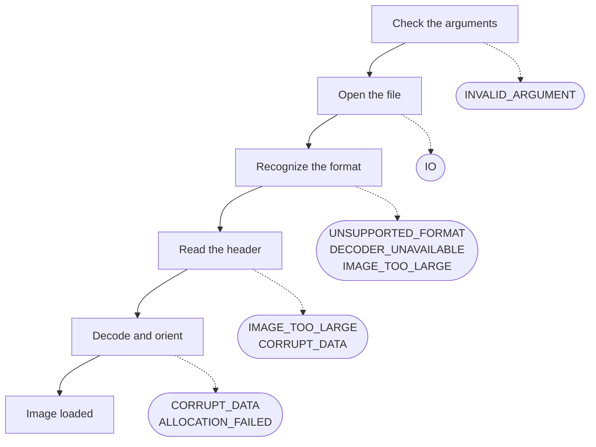

# Handling errors

Every call that can fail says so through its return value, and a program decides from that
value alone what to do next: skip the input, fix the call, or try again. This page lists
every code with that decision, shows which step of a load returns which code, explains the
detail message a failed load leaves behind, and says what a failure leaves in the outputs
and in the context.

## Reading a code

Every function that can fail returns a
[`ph_error_t`](../api/errors.md#ph_error_t):
[`PH_SUCCESS`](../api/errors.md#PH_SUCCESS), which is 0, or a negative code. A test for
`!= PH_SUCCESS` catches every failure; there is no code that means "succeeded with a
warning". Every call whose output is useless without its code, such as
[`ph_create()`](../api/context.md#ph_create), a load, a hash, a batch or a text
conversion, is declared `PH_NODISCARD`, so the compiler warns when its result is dropped.
The setters are not.

The values are part of the ABI and stay fixed for the whole 2.x series: a binding or a
log may store the number. A new code is added at the end with the next free value, and -2
and -4 are never assigned.

[`ph_get_error_string()`](../api/errors.md#ph_get_error_string) turns a code into a fixed
English sentence, the same for every call that returns it, such as "File could not be
opened or read" for `PH_ERR_IO`. It never returns NULL: a number that is not a code,
including -2 and -4, reads "Unknown error". The string is static and needs no freeing.

Comparisons are the exception to the rule. A distance or similarity returned as a number
signals a refused comparison with -1 rather than a code, and only
[`ph_radial_similarity()`](../api/compare.md#ph_radial_similarity) and
[`ph_histogram_intersection()`](../api/compare.md#ph_histogram_intersection) return a
`ph_error_t` ([Comparing hashes](../theory/comparing.md#which-function-for-which-hash)).

## The codes

The codes fall into four groups by what the caller does about them. A **mistake in the
call** is fixed in the code and is never retried. A **verdict on the input** is final for
that input in that build and configuration: the same bytes fail the same way every time,
so the input is skipped and reported. **Out of memory** is the one transient code. The last two codes report how a
batch or a comparison ended, not a fault.

| Code | Value | When | What the caller does |
|---|---|---|---|
| [`PH_ERR_INVALID_ARGUMENT`](../api/errors.md#PH_ERR_INVALID_ARGUMENT) | -3 | any function: a NULL pointer, a value outside the documented range, an empty buffer, a digest of the wrong kind | fixes the call; retrying the same call fails the same way |
| [`PH_ERR_EMPTY_IMAGE`](../api/errors.md#PH_ERR_EMPTY_IMAGE) | -5 | a hash on a context with no image: nothing loaded yet, or the last file or buffer load failed | checks the load's result before hashing |
| [`PH_ERR_REQUIRES_COLOR`](../api/errors.md#PH_ERR_REQUIRES_COLOR) | -11 | ColorHash or ColorMoments on a one-channel image, as [`ph_context_set_load_grayscale()`](../api/loading.md#ph_context_set_load_grayscale) loads it | loads in color for the color hashes; a context for gray hashes and one for color |
| [`PH_ERR_IO`](../api/errors.md#PH_ERR_IO) | -10 | [`ph_load_from_file()`](../api/loading.md#ph_load_from_file): the path is missing, unreadable, not a regular file, or empty | skips the path and reports it with the detail message |
| [`PH_ERR_UNSUPPORTED_FORMAT`](../api/errors.md#PH_ERR_UNSUPPORTED_FORMAT) | -7 | a load: the bytes are in no format the library recognizes, such as TIFF or a text file | skips the input |
| [`PH_ERR_CORRUPT_DATA`](../api/errors.md#PH_ERR_CORRUPT_DATA) | -8 | a load: a recognized format whose data is damaged or truncated, or an animated WebP | skips the input; it fails again on retry |
| [`PH_ERR_DECODER_UNAVAILABLE`](../api/errors.md#PH_ERR_DECODER_UNAVAILABLE) | -9 | a load: WebP, in a build without libwebp | uses a build with libwebp; [`ph_can_use_webp()`](../api/build.md#ph_can_use_webp) tells in advance |
| [`PH_ERR_IMAGE_TOO_LARGE`](../api/errors.md#PH_ERR_IMAGE_TOO_LARGE) | -6 | a load: the image is over the context's `max_pixels`, over a fixed limit, or the encoded data is over 2 GiB | skips the input, or raises [`max_pixels`](../api/loading.md#ph_context_set_max_pixels) for input it trusts |
| [`PH_ERR_ALLOCATION_FAILED`](../api/errors.md#PH_ERR_ALLOCATION_FAILED) | -1 | anything that allocates: [`ph_create()`](../api/context.md#ph_create), loads, hashes, batches | retries later, or with less in flight: fewer batch threads, a lower `max_pixels` |
| [`PH_ERR_CANCELLED`](../api/errors.md#PH_ERR_CANCELLED) | -12 | [`ph_hash_files_ex()`](../api/batch.md#ph_hash_files_ex), [`ph_hash_buffers_ex()`](../api/batch.md#ph_hash_buffers_ex): the `should_continue` callback stopped the batch | treats the items marked with it as not processed |
| [`PH_ERR_NO_STRUCTURE`](../api/errors.md#PH_ERR_NO_STRUCTURE) | -13 | [`ph_radial_similarity()`](../api/compare.md#ph_radial_similarity): a digest is the all-zero Radial digest of an image with no angular structure | treats the pair as not comparable by Radial, and compares it by another hash |

The decision is the same whichever function returned the code. The
[table under `ph_error_t`](../api/errors.md#ph_error_t) in the API reference lists, for
every code, each function that can return it.

## Where a load fails

A load runs its steps in order, and each step can fail with its own codes, on the dashed
branches. A failure at any step ends the load with no image in the context, so the codes of a later step are
never seen for an input an earlier step refused.



- **The file** is opened once, and everything about the path is decided before a decoder
  sees a byte: a missing path, a dangling link, a directory and an empty file are all
  `PH_ERR_IO`, identically on POSIX and on Windows.
  [`ph_load_from_memory()`](../api/loading.md#ph_load_from_memory) skips this step, and
  an empty buffer is `PH_ERR_INVALID_ARGUMENT` at the first.
- **The format** is read from the first bytes, never from the file name. Data no decoder
  claims is `PH_ERR_UNSUPPORTED_FORMAT`; encoded data over 2 GiB is refused here, before
  any format is looked at.
- **The header** gives the dimensions, and the size limits are checked against them before
  the pixels are allocated: a decompression bomb costs a header read, not its pixels.
- **The decode**: once a decoder has claimed the data, every failure from there on is a
  verdict on that data, `PH_ERR_CORRUPT_DATA`, and no other decoder tries it. Running out
  of memory is the exception, `PH_ERR_ALLOCATION_FAILED`, here and while the image is
  turned by its orientation tag.

[`ph_load_from_pixels()`](../api/loading.md#ph_load_from_pixels) has none of these steps.
It fails only on its arguments, the size limit and memory, and a failure keeps the image
loaded before it. [Loading images](loading.md#formats-and-builds) says which
formats each build decodes.

A hash fails before it computes anything, in this order: `PH_ERR_INVALID_ARGUMENT` for an
invalid argument, `PH_ERR_EMPTY_IMAGE` when no image is loaded, and `PH_ERR_REQUIRES_COLOR`
for a color hash of a gray image. After that the only failure left is memory.

## The detail of a failed load

A code says what kind of failure it was; it cannot say which file, or what the operating
system or the decoder said about it.
[`ph_get_last_error_message()`](../api/errors.md#ph_get_last_error_message) adds that for
the last load on a context:

| Code | What the detail adds |
|---|---|
| `PH_ERR_IO` | the path and the reason, such as `Cannot open 'a.jpg': No such file or directory` or `Cannot read 'photos': not a regular file` |
| `PH_ERR_CORRUPT_DATA` | the decoder's own complaint, such as libjpeg-turbo's `Premature end of JPEG file` |
| `PH_ERR_UNSUPPORTED_FORMAT` | the reason stb_image, the decoder of last resort, gave, such as `unknown image type` |
| `PH_ERR_IMAGE_TOO_LARGE` | which limit the image is over |

The message belongs to loads. Every load clears it on the way in, so after a successful
load it is an empty string; a failed load leaves its detail, or an empty string when the
failure has nothing to add to its code, as with every failed `ph_load_from_pixels()`. Hashes, setters and comparisons neither write nor
clear it: after a failed hash, the message still describes the load before it.

The context owns the string. Its text is replaced by the next load on that context and
is gone after [`ph_free()`](../api/context.md#ph_free), so a program that keeps it copies
it first. It is in English and meant for a log or a person, not for a program to parse;
the code is what a program branches on. Like the rest of a context, it is read on the
thread that uses the context, not alongside a load on another.

## What a failure leaves behind

An output is read only after a `PH_SUCCESS`. Most calls leave their outputs as they were
when they fail, and the ones that state it in the API reference, such as the color hashes and the
functions that read a hash back from text, promise it. Three write before they can tell they will fail:

- [`ph_compute_multi()`](../api/hash64.md#ph_compute_multi) stops at the first algorithm
  that fails, and the slots of those before it already hold their hashes. Nothing in the
  array says how far it got, so on a failure the whole array is unusable.
- mHash, BMH and Radial clear the digest before they allocate their working memory, so
  when that allocation fails the digest is zeroed rather than left as it was.
- A batch item that fails has every hash slot zeroed and its code in `status`.

A setter that refuses a value leaves the configuration as it was: no value is clamped
into range or half applied ([Configuring a context](configuring.md)). A failed file or
buffer load drops the image the context held, so a hash after it fails with
`PH_ERR_EMPTY_IMAGE` instead of hashing the image before; a failed pixel load keeps it.

## In code

The example loads and hashes each path it is given and prints, for each, the code's
sentence, what to do about it and the detail of the load. The decisions are one
`switch` over the codes:

```c title="examples/error_handling.c"
--8<-- "examples/error_handling.c:what_to_do"
```

Each path is loaded into the same context, the hash runs only after a successful load, and
the detail is printed only for a failure, since after a success it is empty:

```c title="examples/error_handling.c"
--8<-- "examples/error_handling.c:load"
```

When the last path fails, the context holds no image, and a hash says so rather than
hashing an earlier one:

```c title="examples/error_handling.c"
--8<-- "examples/error_handling.c:empty"
```

The context's `max_pixels` is set low in this example, so that an ordinary photograph shows
`PH_ERR_IMAGE_TOO_LARGE` as well.

## Errors in a batch

A batch reports twice: the call returns a code for the batch as a whole, and every item
carries its own in `status`. One unreadable file fails only its own item.

| The call returns | Which means | The items |
|---|---|---|
| `PH_SUCCESS` | every item was processed | each `status` holds the code its load or hash returned |
| `PH_ERR_INVALID_ARGUMENT` | the call itself is malformed: the flags, the thread count, the options | nothing was written |
| `PH_ERR_ALLOCATION_FAILED` | not one worker could start | no item was worked on |
| `PH_ERR_CANCELLED` | `should_continue` stopped the batch | started items have their real status; the rest have `PH_ERR_CANCELLED` |

An item's `status` takes the same codes a load and
[`ph_compute_multi()`](../api/hash64.md#ph_compute_multi) return, and an entry with a NULL
path, a NULL buffer or a zero length is a `PH_ERR_INVALID_ARGUMENT` of that item alone.
The `hashes` of an item are valid only when its `status` is `PH_SUCCESS`.

```c title="examples/batch_hash.c"
--8<-- "examples/batch_hash.c:statuses"
```

An item has a code and no detail message: each worker's context is freed when the batch
ends. A program that wants the detail for a failed item loads that one file again with
`ph_load_from_file()` and reads
[`ph_get_last_error_message()`](../api/errors.md#ph_get_last_error_message).
[Hashing many files](../batch.md) covers the rest of a batch.
