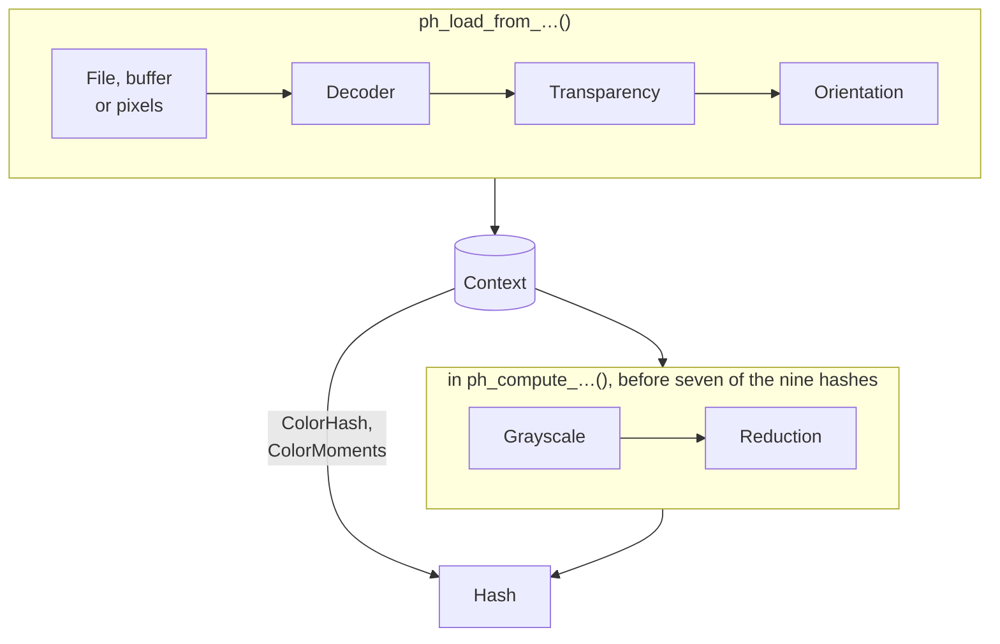

# How libphash works

Every hash in libphash comes out of the same short path: an image is loaded into a
context, the context prepares it, and a hash function reads it. This page is a map of that
path: what runs at each step, which settings reach it, which error codes it can return, and
what the context keeps between calls. Each step has a page of its own, linked from here;
this one says how the steps fit together.

## The path of an image

The load steps run once, inside a `ph_load_from_*()` call, and leave the image in the
context. The hash steps run inside each `ph_compute_*()` call, on that image. Seven of the
nine algorithms go through grayscale and reduction; ColorHash and ColorMoments read the
color image directly, the arrow from the context straight to the hash.
Comparing two hashes takes no context at all.

| Step | Runs in | Settings that reach it | Codes it can return |
|---|---|---|---|
| Reading the source | the load | — | `PH_ERR_INVALID_ARGUMENT`, `PH_ERR_IO` |
| [Decoding](../theory/preparation.md#decoding) | the load | `max_pixels`, `decode_scale`, `load_grayscale` | `PH_ERR_UNSUPPORTED_FORMAT`, `PH_ERR_DECODER_UNAVAILABLE`, `PH_ERR_IMAGE_TOO_LARGE`, `PH_ERR_CORRUPT_DATA`, `PH_ERR_ALLOCATION_FAILED` |
| [Transparency](../theory/preparation.md#transparency) | the load | `alpha_mode` | — |
| [Orientation](../theory/preparation.md#orientation) | the load, from a file or a buffer | `auto_orient` | `PH_ERR_ALLOCATION_FAILED` |
| [Grayscale](../theory/preparation.md#grayscale) | the first hash that needs it, then kept | gray weights | `PH_ERR_ALLOCATION_FAILED` |
| [Reduction](../theory/preparation.md#reduction) | each hash | the algorithm's parameters | `PH_ERR_ALLOCATION_FAILED` |
| The hash | `ph_compute_*()` | the algorithm's parameters | `PH_ERR_INVALID_ARGUMENT`, `PH_ERR_EMPTY_IMAGE`, `PH_ERR_REQUIRES_COLOR` |
| [Comparing](../theory/comparing.md) | `ph_hamming_distance()` and the others | — | a digest of the wrong kind is refused |

[Configuring a context](configuring.md#every-setting) lists every setting with its range
and default, and says [when each is read](configuring.md#when-a-setting-is-read): a load
setting by the next load, a hash setting by the next hash.
[Handling errors](errors.md#the-codes) says what each code means and what to do about it,
and [which step of a load](errors.md#where-a-load-fails) returns it.

[`ph_load_from_pixels()`](../api/loading.md#ph_load_from_pixels) enters the path at
transparency: it takes pixels that are already decoded, so there is no source to read, no
decoder and no orientation tag
([Loading images](loading.md#from-pixels)).

## What a context holds

A [`ph_context_t`](../api/context.md#ph_context_t) is created by
[`ph_create()`](../api/context.md#ph_create), freed by
[`ph_free()`](../api/context.md#ph_free), and holds four things between the two:

- **The loaded image**, at most one: its pixels after the load steps, and what the hashes
  derive from it — the grayscale image and the area sums several hashes reduce from. The
  first hash that needs them computes them, and the next hash of the same image reuses
  them. The next load replaces all of it
  ([One context, many images](loading.md#one-context-many-images)).
- **The settings**, thirteen of them, each starting at its default. A load or a hash reads
  them; nothing else changes them but the setters.
- **Scratch memory** for the hashes' working buffers, grown on demand and kept for the
  next hash, so hashing a stream of images of similar size does not allocate it again. It
  is released by [`ph_free()`](../api/context.md#ph_free).
- **The detail of the last failed load**, the text
  [`ph_get_last_error_message()`](../api/errors.md#ph_get_last_error_message) returns
  ([Handling errors](errors.md#the-detail-of-a-failed-load)).

Because of the first three, a context is the unit of reuse: loading the next image into
the same context keeps its settings and its memory. Because of all four, it is also the
unit of threading. One context is used by one thread at a time, and two threads with a
context each need no lock between them. [`ph_hash_files()`](../api/batch.md#ph_hash_files) follows the same
rule inside: each of its workers creates a context of its own, configured as a copy of a
template ([Hashing many files](../batch.md#threads-what-is-safe)). One image is always
loaded and hashed on one thread
([One image, one thread](performance.md#one-image-one-thread)).

## Which decoder reads a file

The first bytes of the data choose the decoder, never the file name. The decoders a build
has are fixed when it is compiled, and are tried in order: the native decoders first,
libjpeg-turbo, libpng and libwebp, each for its own format, then stb_image, which is in
every build and takes whatever none of them claimed. That is why the two builds read
different sets of formats:

- **The Full build** decodes JPEG, PNG and WebP with the native decoders, and BMP, GIF,
  TGA, PSD, HDR, PIC and PNM with stb_image.
- **The Minimal build** has only stb_image, which also reads JPEG and PNG, but not WebP: a
  WebP file is refused with `PH_ERR_DECODER_UNAVAILABLE` rather than as an unknown format.

TIFF is read by neither. The table of formats per build, and what happens to an animated
GIF or WebP, are on [Loading images](loading.md#formats-and-builds); which build to install
is on [Installing](install.md#two-builds-full-and-minimal). A program asks the build it runs
on with [`ph_can_use_jpeg()`](../api/build.md#ph_can_use_jpeg),
[`ph_can_use_png()`](../api/build.md#ph_can_use_png) and
[`ph_can_use_webp()`](../api/build.md#ph_can_use_webp), or logs every decoder at once with
[`ph_get_build_info()`](../api/build.md#ph_get_build_info).

## Where to read on

| To | Read |
|---|---|
| load images, untrusted ones included | [Loading images](loading.md) |
| give contexts the same settings | [Configuring a context](configuring.md) |
| keep hashes and find near duplicates | [Storing and searching hashes](storing.md) |
| act on a failure | [Handling errors](errors.md) |
| make hashing cheaper | [Performance](performance.md) |
| hash many files on several threads | [Hashing many files](../batch.md) |
| know what a step does to a hash | [Image preparation](../theory/preparation.md) |
| see where each part lives in the source | [Development: source map](../development.md#source-map) |
