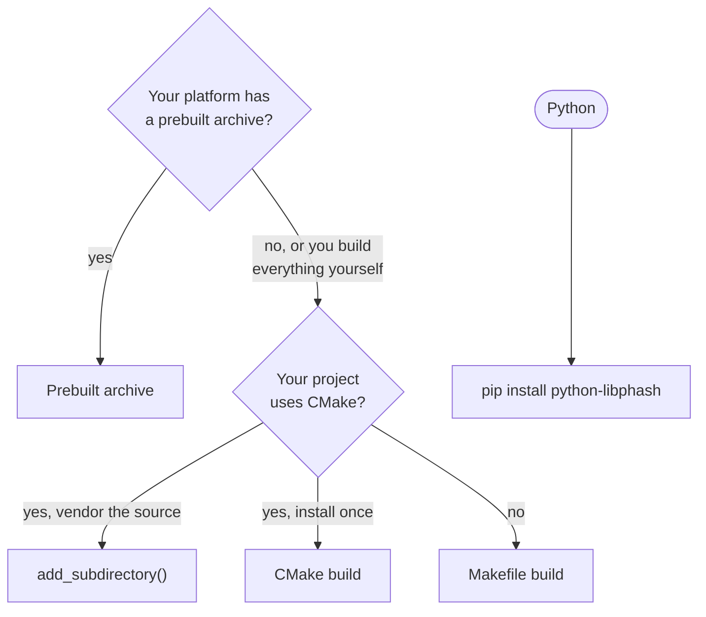

# Installing

libphash is a C library with one public header, `libphash.h`. There are four ways to get
it into a program: a prebuilt archive, a CMake build from source, a Makefile build from
source, or the source tree inside your own CMake project. Python has its own package.
This page covers each of them, what the two builds differ in, and how to check the
result.



## Two builds: Full and Minimal

The library decodes images itself. Which decoders it has depends on how it was built:

| Build | Decoders | Dependencies | Made by |
| --- | --- | --- | --- |
| **Full** | libjpeg-turbo, libpng with zlib-ng, libwebp; stb_image for everything else | none outside the repository: the decoders are git submodules under `vendor/` | the prebuilt archives, `cmake --preset release` |
| **Minimal** | stb_image for every format | none | the Makefile, `cmake --preset minimal`, a CMake build of a checkout without submodules |

What the Full build adds:

- **Speed.** libjpeg-turbo decodes JPEG to gray 1.4 to 6.4 times faster than stb_image,
  and libpng with zlib-ng decodes photographic PNG 1.25 to 1.7 times faster on Linux
  ([measured](../benchmarks/2026-10-04-decoders-vs-stb.md)). Decoding takes most of the
  time of a cheap hash on a large image ([Performance](performance.md)).
- **WebP.** stb_image has no WebP decoder: a Minimal build answers a WebP file with
  [`PH_ERR_DECODER_UNAVAILABLE`](../api/errors.md#PH_ERR_DECODER_UNAVAILABLE). The
  Makefile can link a system libwebp instead (below).
- **Scaled JPEG decoding.**
  [`ph_context_set_decode_scale()`](../api/loading.md#ph_context_set_decode_scale)
  decodes a JPEG at 1/2, 1/4 or 1/8 of its size through libjpeg-turbo; stb_image always
  decodes at full size.

Both builds read BMP, GIF (the first frame), TGA, PSD, HDR, PIC and PNM through stb_image.
Neither reads TIFF.

The two builds round JPEG's inverse DCT differently, so a JPEG reaches the hash as
slightly different pixels and its hash can differ in a few bits between them. Hashes
stored from one build are compared with hashes from the other by distance, not by
equality ([Same hash on every machine](../theory/comparing.md#same-hash-on-every-machine)).
Every other difference between builds — operating system, architecture, compiler, SIMD
level, static or shared — leaves every hash the same.

## Prebuilt archive

Each release on the [releases page](https://github.com/gudoshnikovn/libphash/releases)
carries a Full build for four platforms, static and shared:

| Platform | Static | Shared |
| --- | --- | --- |
| Linux x86-64 | `libphash-2.0.0-linux-x86_64.tar.gz` | `libphash-2.0.0-linux-x86_64-shared.tar.gz` |
| Linux arm64 | `libphash-2.0.0-linux-arm64.tar.gz` | `libphash-2.0.0-linux-arm64-shared.tar.gz` |
| macOS arm64 | `libphash-2.0.0-macos-arm64.tar.gz` | `libphash-2.0.0-macos-arm64-shared.tar.gz` |
| Windows x86-64 | `libphash-2.0.0-windows-x86_64.zip` | `libphash-2.0.0-windows-x86_64-shared.zip` |

An archive unpacks into one directory named like the archive, with `include/` (the two
headers), `lib/` (the library, and in a static archive the decoder libraries it needs),
`lib/cmake/phash/` (the CMake package), `lib/pkgconfig/libphash.pc`, `LICENSE` and
`THIRD-PARTY-NOTICES.md`. The shared Windows archive keeps `phash.dll` in `bin/` and its
import library in `lib/`. The directory can be moved anywhere: both the CMake package and
`libphash.pc` find the files relative to themselves.

**CPU.** The x86-64 archives need SSE4.2 and POPCNT (the x86-64-v2 level, which every
x86-64 CPU since 2009–2011 has); the arm64 archives need ARMv8-A, whose Advanced SIMD
every arm64 CPU has. Nothing needs AVX: libjpeg-turbo, libwebp and zlib-ng use wider
instructions when the CPU has them, decided at run time.

**Checking a download.** `SHA256SUMS.txt` in the same release covers every archive and
shows the download is intact. The build provenance attestation shows that the archive was
built by this repository's release workflow from the tagged commit; checking it needs the
[GitHub CLI](https://cli.github.com/):

=== "Linux"

    ```sh
    sha256sum --ignore-missing -c SHA256SUMS.txt
    gh attestation verify libphash-2.0.0-linux-x86_64.tar.gz --repo gudoshnikovn/libphash
    tar -xzf libphash-2.0.0-linux-x86_64.tar.gz
    ```

=== "macOS"

    ```sh
    shasum -a 256 --ignore-missing -c SHA256SUMS.txt
    gh attestation verify libphash-2.0.0-macos-arm64.tar.gz --repo gudoshnikovn/libphash
    tar -xzf libphash-2.0.0-macos-arm64.tar.gz
    ```

=== "Windows (PowerShell)"

    ```powershell
    Get-FileHash libphash-2.0.0-windows-x86_64.zip -Algorithm SHA256
    gh attestation verify libphash-2.0.0-windows-x86_64.zip --repo gudoshnikovn/libphash
    Expand-Archive libphash-2.0.0-windows-x86_64.zip -DestinationPath .
    ```

    `Get-FileHash` prints the hash; compare it with the archive's line in
    `SHA256SUMS.txt`.

Both checks fail on an archive that is not byte for byte the one the release workflow
built; [Verifying a release artifact](../project/security.md#verifying-a-release-artifact)
explains what each one proves. The archives are reproducible: building the tagged commit
the same way gives the same bytes
([Reproducible archives](../development.md#reproducible-archives)).

Then link against the unpacked directory as described in
[Using an installed libphash](#using-an-installed-libphash).

## CMake build from source

The CMake build is the Full one. It needs CMake 3.21 or newer, a C17 compiler (GCC, Clang
or MSVC) and the decoder submodules. On x86-64, libjpeg-turbo also wants NASM or Yasm for
its SIMD code; without one, the configure warns `SIMD extensions disabled` and JPEG
decoding works, slower.

```sh
git clone --recursive https://github.com/gudoshnikovn/libphash.git
cd libphash
cmake --preset release
cmake --build --preset release
ctest --preset release
cmake --install build/release --prefix "$HOME/.local"
```

`--recursive` fetches the four decoders; in a clone made without it,
`git submodule update --init --recursive` does the same. The `release` preset refuses to
configure without them rather than build a Minimal library under the Full name.

`cmake --install` writes the headers, `libphash.a` and the decoder libraries, the
`phash::phash` CMake package and `libphash.pc` under the prefix. On Linux and macOS a
prefix you cannot write to, such as the default `/usr/local` on most systems, needs `sudo`
for the install step only.

The presets a consumer is likely to want:

| Preset | Builds | In |
| --- | --- | --- |
| `release` | Full, static library | `build/release` |
| `shared` | Full, shared library | `build/shared` |
| `minimal` | Minimal: stb_image only, no submodules needed | `build/minimal` |

Every preset uses its own build directory, so two of them can sit side by side. A shared
build installs `libphash.so.2` (Linux), `libphash.2.dylib` (macOS) or `phash.dll`
(Windows) with the decoders linked inside it, so nothing else is installed with it. The
other presets are CI configurations: sanitizers, Valgrind, 32-bit x86, fuzzing
([Presets](../development.md#presets-and-supported-option-combinations)).

Options for a configure of your own, `cmake -B build -D<option>=<value>`:

| Option | Default | What it changes |
| --- | --- | --- |
| `PHASH_BUILD_SHARED` | `OFF` | a shared library instead of a static one |
| `PHASH_USE_LIBJPEG_TURBO` | `ON` | JPEG through the bundled libjpeg-turbo; `OFF` — through stb_image |
| `PHASH_USE_LIBPNG` | `ON` | PNG through the bundled libpng; `OFF` — through stb_image |
| `PHASH_USE_ZLIB_NG` | `ON` | libpng inflates with the bundled zlib-ng; `OFF` — with the system zlib |
| `PHASH_USE_WEBP` | `ON` | WebP through the bundled libwebp; `OFF` — no WebP |
| `PHASH_ENABLE_THREADS` | `ON` | a worker pool for [batch hashing](batch.md); `OFF` — batches run on the calling thread, and no thread library is linked |
| `PHASH_OPTIMIZE_NATIVE` | `OFF` | `-march=native`: a library for this CPU only, not for others of its architecture |
| `PHASH_STRICT_DEPS` | `OFF` | a missing decoder submodule fails the configure, instead of a warning and stb_image in its place (the `release` preset turns it on) |
| `PHASH_BUILD_TESTS` | `ON` | the test programs `ctest` runs |

The decoder options are independent of each other; zlib-ng is used only by libpng. The
full list, with the Makefile's equivalents, is in
[Build systems and their defaults](../development.md#build-systems-and-their-defaults).

## Makefile build from source

The Makefile builds the Minimal library with no dependencies and no submodules, on Linux
and macOS:

```sh
git clone https://github.com/gudoshnikovn/libphash.git
cd libphash
make -j8
make test -j8
make install PREFIX="$HOME/.local"
```

`make install` writes `libphash.a`, the two headers and `libphash.pc` under `PREFIX`
(default `/usr/local`; `DESTDIR` stages the install elsewhere), and `make uninstall` with
the same `PREFIX` removes them. The Makefile builds only the static library and installs
no CMake package: a CMake project links it through `pkg-config`.

WebP through a system libwebp:

```sh
make -j8 USE_WEBP=1 EXTRA_CFLAGS="$(pkg-config --cflags libwebp)" \
                    EXTRA_LDFLAGS="$(pkg-config --libs-only-L libwebp)"
make install PREFIX="$HOME/.local" USE_WEBP=1
```

The installed `libphash.pc` then asks for `-lwebp -lwebpdecoder`; if libwebp lives outside
the linker's default path (Homebrew's `/opt/homebrew/lib`), the program's link line needs
its directory too. Other switches — `PHASH_ENABLE_THREADS=0`, `CC=gcc`, `EXTRA_CFLAGS` —
are in [Build systems and their defaults](../development.md#build-systems-and-their-defaults).

## Inside your own CMake project

A CMake project can carry the libphash source tree, as a git submodule or a copy, and
build it with everything else:

```cmake
add_subdirectory(third_party/libphash)
target_link_libraries(my_app PRIVATE phash)
```

The `phash` target brings its include directory and decoders with it. Set
`PHASH_BUILD_TESTS` to `OFF` if you don't run its tests; the other options above apply
here too. Your project's own `BUILD_SHARED_LIBS` and `BUILD_TESTING` stay as you set them.
The decoder submodules have to be checked out inside the copy; without them libphash
builds with stb_image and says so in one configure warning.

## Using an installed libphash

Both an archive and an install from source are used the same way:

=== "pkg-config"

    ```sh
    export PKG_CONFIG_PATH="<prefix>/lib/pkgconfig"
    cc main.c -o my_app $(pkg-config --cflags --libs libphash)
    ```

    `<prefix>` is the install prefix or the unpacked archive. `libphash.pc` lists every
    library the build needs, so the link line never has to name them. For the static Linux
    archive and for a Minimal build on macOS they are

    ```text
    -lphash -lphash_jpeg -lpng16 -lwebpdecoder -lz -lm -ldl -lpthread
    -lphash -lm -lpthread
    ```

=== "CMake"

    ```cmake
    find_package(phash 2 REQUIRED)
    target_link_libraries(my_app PRIVATE phash::phash)
    ```

    ```sh
    cmake -S . -B build -DCMAKE_PREFIX_PATH=<prefix>
    cmake --build build
    ```

    `phash::phash` carries the include path, the decoder libraries of a static build and
    the definitions the headers need. `find_package(phash 2)` accepts any 2.x.

A shared library is found at run time without `LD_LIBRARY_PATH` or `DYLD_LIBRARY_PATH`:
the program records the library's directory (rpath) at link time, through either route.
On Windows there is no rpath: `phash.dll` has to sit next to the program or on `PATH`.

**Windows.** Use the CMake package. The archives' `libphash.pc` is not tested there. A
build system other than CMake that links the *static* library on Windows defines
`PHASH_STATIC_DEFINE` before including `libphash.h`; without it the header declares every
function as imported from a DLL.

## Python

[`python-libphash`](https://github.com/gudoshnikovn/python-libphash) is the official
Python binding, maintained together with the library:

```sh
pip install python-libphash
```

It is a separate project that follows a new libphash release after a delay. From 2.0.1 on,
its version is the libphash version it contains followed by a revision of the binding:
`python-libphash` 2.0.1.*N* contains libphash 2.0.1, so `pip install "python-libphash==2.0.1.*"`
pins the library. The 1.x releases are numbered independently and state the libphash
version they contain in their README. Hashes are comparable only between the same
libphash version and settings, so a collection hashed partly from C and partly from Python
needs both on the same libphash. Bindings for other languages are planned.

## Check the installation

[`examples/basic_hash.c`](https://github.com/gudoshnikovn/libphash/blob/main/examples/basic_hash.c)
loads one image and prints its pHash:

```sh
cc basic_hash.c -o basic_hash $(pkg-config --cflags --libs libphash)
./basic_hash photo.jpg
```

On the repository's `tests/data/photo.jpeg` it prints `pHash: 7eb66192bc394247` from
every build, Full and Minimal: this photograph's hash happens to come out the same under
both JPEG decoders.

To see what a library was built with, print
[`ph_get_build_info()`](../api/build.md#ph_get_build_info) — the program in
[`examples/cmake_consumer/`](https://github.com/gudoshnikovn/libphash/tree/main/examples/cmake_consumer)
does that:

```c title="examples/cmake_consumer/main.c"
--8<-- "examples/cmake_consumer/main.c"
```

```text
libphash 2.0.0 (header 2.0.0)
version=2.0.0 jpeg=libjpeg-turbo png=libpng webp=libwebp zlib=zlib-ng threads=on simd=neon mock=off
```

That is a Full build on arm64; a Minimal one says `jpeg=stb png=stb webp=none zlib=none`.
The first line catches a header and a library from different installs: the two versions
differ. A program that has to branch on a decoder asks
[`ph_can_use_jpeg()`](../api/build.md#ph_can_use_jpeg),
[`ph_can_use_png()`](../api/build.md#ph_can_use_png) and
[`ph_can_use_webp()`](../api/build.md#ph_can_use_webp) instead of parsing that line.

Next: [Quick start](quickstart.md) hashes and compares images.
