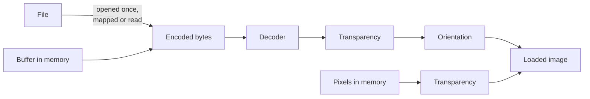

# Loading images

Every hash reads the image last loaded into a context. This page covers the three ways to
load one, which formats each build reads, how to load images you do not trust, the
settings that shape what is loaded, and how one context serves many images.
[Image preparation](../theory/preparation.md) explains what each step does to a hash, with
measurements; this page says when to reach for it.



## Three sources

| Source | Function | Use it for |
|---|---|---|
| A file | [`ph_load_from_file()`](../api/loading.md#ph_load_from_file) | images on disk |
| An encoded file in memory | [`ph_load_from_memory()`](../api/loading.md#ph_load_from_memory) | bytes from a network, a database, an archive |
| Decoded pixels | [`ph_load_from_pixels()`](../api/loading.md#ph_load_from_pixels) | a frame another library has already decoded |

The program below makes one picture and loads it all three ways: as pixels, as a PPM file
encoded in a buffer, and as the same file on disk. It prints the same pHash three times.

```c title="examples/load_sources.c"
--8<-- "examples/load_sources.c:pixels"

--8<-- "examples/load_sources.c:memory"

--8<-- "examples/load_sources.c:file"
```

The whole program is
[`examples/load_sources.c`](https://github.com/gudoshnikovn/libphash/blob/main/examples/load_sources.c).

### From a file or a buffer

[`ph_load_from_file()`](../api/loading.md#ph_load_from_file) opens the file once and
hands its whole content to the decoder, memory-mapped where the platform has `mmap` and
read into a buffer otherwise. From there it is
[`ph_load_from_memory()`](../api/loading.md#ph_load_from_memory): the same decoders, the
same limits, the same orientation, and the same hash for the same bytes, as if you had
read the file yourself.

The decoder is chosen by the first bytes, never by the file name, so an image with the
wrong extension loads as what it is. A buffer may run on past the image's end; the bytes
after it are ignored. A buffer that ends before the image does is refused, as a truncated
file is ([Decoding](../theory/preparation.md#decoding)).

### From pixels

[`ph_load_from_pixels()`](../api/loading.md#ph_load_from_pixels) copies pixels you already
have. It takes:

- **width and height**, both above 0;
- **channels**: 1 (gray), 3 (RGB) or 4 (RGBA with straight alpha, not premultiplied),
  interleaved;
- **stride**, the number of bytes from the start of one row to the start of the next, or
  0 for rows packed with no gap. The example pads every row to 512 bytes and passes 512.

The channels are read as red, green, blue in that order. A buffer in BGR order, as OpenCV
keeps its images, gives other grayscale values and other color statistics: swap the
channels before loading.

A 4-channel image is composited onto the [alpha mode's](#transparency) background, like a
decoded one. Nothing in a pixel buffer says which way is up, so there is no orientation to
apply: pass the pixels upright. The pixel count is held to
[`max_pixels`](#untrusted-and-large-images); the per-side limit, which protects decoders,
does not apply.

The same pixels hash the same whichever way they arrive: the example's three hashes are
equal, and it exits with an error if they are not.

## Formats and builds

The formats a build reads depend on which decoders it was built with
([Installing](install.md#two-builds-full-and-minimal)):

| Format | Full build | Minimal build |
|---|---|---|
| JPEG | libjpeg-turbo | stb_image |
| PNG | libpng | stb_image |
| WebP | libwebp | refused: [`PH_ERR_DECODER_UNAVAILABLE`](../api/errors.md#PH_ERR_DECODER_UNAVAILABLE) |
| BMP, GIF, TGA, PSD, HDR, PIC, PNM | stb_image | stb_image |
| TIFF and anything else | refused: [`PH_ERR_UNSUPPORTED_FORMAT`](../api/errors.md#PH_ERR_UNSUPPORTED_FORMAT) | the same |

Two kinds of file load other than a reader might expect:

- **An animated GIF** loads as its first frame. There is no way to choose another.
- **An animated WebP** is refused as
  [`PH_ERR_CORRUPT_DATA`](../api/errors.md#PH_ERR_CORRUPT_DATA). libwebp's simple decoder,
  which the library uses, cannot read a frame out of an animation. A still WebP loads as
  usual.

A program that depends on a format asks the build at run time:
[`ph_can_use_jpeg()`](../api/build.md#ph_can_use_jpeg),
[`ph_can_use_png()`](../api/build.md#ph_can_use_png) and
[`ph_can_use_webp()`](../api/build.md#ph_can_use_webp) say whether the native decoder is
there. [`ph_get_build_info()`](../api/build.md#ph_get_build_info) names every decoder in
one line, for a log or a bug report:

```c title="examples/cmake_consumer/main.c"
--8<-- "examples/cmake_consumer/main.c"
```

The two JPEG decoders round differently, so a JPEG can hash a few bits apart between a
Full and a Minimal build. Hashes stored from one build are compared with another's by
distance, not equality
([Same hash on every machine](../theory/comparing.md#same-hash-on-every-machine)).

## Untrusted and large images

A small file can declare an enormous image. The library checks the dimensions a file
declares before it allocates anything for its pixels, and refuses an image over the limit
with [`PH_ERR_IMAGE_TOO_LARGE`](../api/errors.md#PH_ERR_IMAGE_TOO_LARGE):

- [`ph_context_set_max_pixels()`](../api/loading.md#ph_context_set_max_pixels) sets the
  most pixels, width × height, a load accepts; 256 × 1024 × 1024 by default. A service that
  hashes uploads sets it to the largest image it expects. 0 removes this limit but not the
  fixed ones.
- Fixed limits always apply: 2 147 483 647 pixels, the largest count the library indexes;
  1 000 000 pixels on either side, so that one enormous row cannot pass the area limit;
  and 2 GiB − 1 byte of encoded file ([Size limits](../theory/preparation.md#size-limits)).

What a load holds in memory, at its peak, is the encoded file (mapped or read), the
decoded image at 3 bytes a pixel (1 when [loaded as grayscale](#loading-as-grayscale)),
and a second image of the same size while an orientation is applied. The
first grayscale hash adds 1 byte a pixel, kept until the next load.

A large JPEG can also be decoded at ½, ¼ or ⅛ of its size with
[`ph_context_set_decode_scale()`](../api/loading.md#ph_context_set_decode_scale). That
saves time after the decode more than in it, and changes some hashes more than others:
[Decoding at a reduced scale](../theory/preparation.md#decoding-at-a-reduced-scale) has
both measured. The limit is still judged by the full dimensions.

## Settings that shape the image

These settings are read when an image is loaded, so they apply from the next load on; an
image already loaded keeps what it was loaded with. Hashes are comparable only when
computed with the same settings.

| Setting | Default | Change it when |
|---|---|---|
| [`ph_context_set_auto_orient()`](../api/loading.md#ph_context_set_auto_orient) | on: the EXIF orientation is applied | the stored orientation is what you want to compare ([Orientation](../theory/preparation.md#orientation)) |
| [`ph_context_set_alpha_mode()`](../api/loading.md#ph_context_set_alpha_mode) | composited on gray | your images are cut-outs whose visible part is close to mid-gray, or you match hashes from ImageHash ([Transparency](#transparency)) |
| [`ph_context_set_load_grayscale()`](../api/loading.md#ph_context_set_load_grayscale) | off: color | you compute no color hash ([below](#loading-as-grayscale)) |
| [`ph_context_set_decode_scale()`](../api/loading.md#ph_context_set_decode_scale) | full size | large JPEGs, and a hash that tolerates it ([above](#untrusted-and-large-images)) |
| [`ph_context_set_max_pixels()`](../api/loading.md#ph_context_set_max_pixels) | 256 × 1024 × 1024 | [above](#untrusted-and-large-images) |

### Transparency

An image with an alpha channel is composited onto a background as it loads, mid-gray by
default, so that the color stored under transparent pixels, which no viewer shows, does
not reach the hash. No background is best for every algorithm: on white, wHash gives
every mostly transparent image the same hash; on black, BMH does. Which background suits
which algorithm is measured in [Which background](../theory/preparation.md#which-background).
`PH_ALPHA_IGNORE` keeps the stored color, which is what ImageHash hashes.

### Loading as grayscale

[`ph_context_set_load_grayscale()`](../api/loading.md#ph_context_set_load_grayscale)
asks the decoder for one channel instead of three. A JPEG's decoder then skips its color
conversion, stb_image converts as it decodes, the PNG decoder converts each row as it is
decoded, the WebP decoder converts once the image is decoded, and the library skips its
own conversion: the loaded image is a third of the size, and the grayscale hashes read it
as it is.

--8<-- "docs/assets/generated/loading/load-times.md"

The saving is a part of the load, not a multiple of it: the decoding of the compressed
data stays.[^cost] It is worth taking for a JPEG when every hash you compute is a
grayscale one; on a PNG or a WebP it saves memory, not time
([Decoding by format](performance.md#decoding-by-format)). Two things come with it:

- **ColorHash and ColorMoments refuse the image** with
  [`PH_ERR_REQUIRES_COLOR`](../api/errors.md#PH_ERR_REQUIRES_COLOR): one channel has no
  color to count.
- **A JPEG's grayscale comes from the file**, rounded where the library's own conversion
  truncates, so a hash can move by a bit or two against a color load of the same file
  ([The decoder's grayscale](../theory/preparation.md#the-decoders-grayscale)). Hashes
  stored with the setting on are compared with hashes computed with it on.

??? info "How this was measured"

    Each case of `site_stages time` loads the file, and computes pHash where the table
    says so, in a loop: one warm-up, then at least 5 runs and 1 second; the table gives
    the fastest run. Without "created and freed", each kind of load has a context of its
    own, kept from run to run.

    ```python title="tools/site/pages/loading.py"
    --8<-- "tools/site/pages/loading.py:loads"
    ```

    ```c title="tools/site/stages/timing.c"
    --8<-- "tools/site/stages/timing.c:time"
    ```

    ```sh
    cmake --preset release && cmake --build --preset release --target site_stages
    build/release/site_stages time tests/data/photo.jpeg
    ```

## One context, many images

A context holds one image at a time, and its settings. Load the next image into the same
context:

- **A load replaces the image.** It frees the previous image and the grayscale cached
  from it before it decodes the next one. The settings stay as they were set.
- **A failed load from a file or a buffer leaves the context empty**, whatever it failed
  on, its arguments included: the previous image is dropped as soon as the call starts,
  so the next hash fails with [`PH_ERR_EMPTY_IMAGE`](../api/errors.md#PH_ERR_EMPTY_IMAGE) rather than
  describing the image before it.
  [`ph_load_from_pixels()`](../api/loading.md#ph_load_from_pixels) is checked before it
  replaces anything, and a call it refuses leaves the previous image loaded.
  [`ph_is_loaded()`](../api/context.md#ph_is_loaded) and
  [`ph_context_get_dimensions()`](../api/context.md#ph_context_get_dimensions) say what
  the context holds.
- **Hashes of one image share their work.** The grayscale image and the area sums are
  computed by the first hash that needs them and kept until the next load, so several
  hashes of one load cost less than as many loads.
  [`ph_compute_multi()`](../api/hash64.md#ph_compute_multi) computes several 64-bit hashes
  in one call.

A context created and freed for each image takes about as long as one kept, the last
row of the table above: keeping one saves little time, and keeps the settings in one
place.

A context is used by one thread at a time. A program that loads on several threads gives
each its own context, or hands the files to
[`ph_hash_files()`](../api/batch.md#ph_hash_files), whose workers do the same
([Hashing many files](batch.md)).

## When a load fails

A failed load returns one of seven codes, and a failed file or buffer load leaves no image
in the context. [Handling errors](errors.md) lists what each code means and what to do
about it, [which step of a load](errors.md#where-a-load-fails) returns it, and the [detail
message](errors.md#the-detail-of-a-failed-load) that names the file and the reason.

--8<-- "docs/assets/generated/timing/footnote.md"
