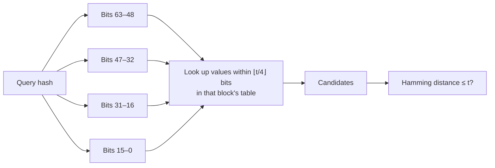
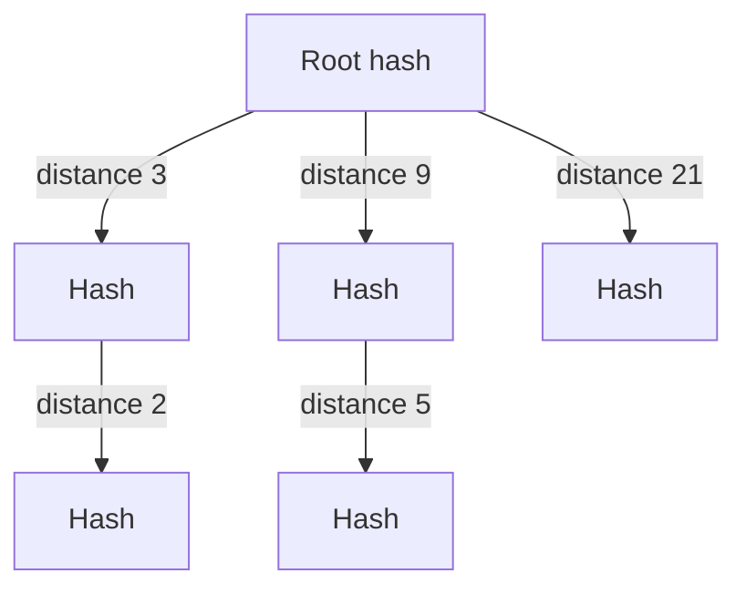

# Storing and searching hashes

A hash is computed once and compared many times: it is stored with the record of its
image, and a new image's hash is searched for among the stored ones. This page says what
has to be stored beside a hash for it to stay comparable, how each algorithm's hash is
stored, what a search by comparing with every stored hash costs, measured, and how an
index cuts that cost when it grows too large. The library compares two hashes; storage
and indexes belong to the program, and the library has neither.

## What a hash does not record

A `uint64_t` hash or a `ph_digest_t` holds the hash's bits and nothing about how they were
computed. Two hashes are comparable only when four things are the same for both, and none
of them can be read from the hash afterwards:

- **The algorithm.** A digest's `kind` refuses a comparison across kinds, but six
  algorithms produce `bits`, and the four 64-bit hashes have no `kind` at all: an aHash
  compared with a pHash returns a distance like any other.
  [`ph_algorithm_name()`](../api/algorithms.md#ph_algorithm_name) gives each algorithm a
  stable name to store, and
  [`ph_algorithm_from_name()`](../api/algorithms.md#ph_algorithm_from_name) reads it back.
- **The settings that change the value**, every one except the size limit
  ([Configuring a context](configuring.md#settings-that-change-the-hash) lists them).
- **The library version.** A release that changes what an algorithm computes says so in
  the [changelog](../project/changelog.md), and names the algorithms whose stored hashes
  are to be recomputed. [`ph_version_number()`](../api/build.md#ph_version_number) is
  one integer to store.
- **The JPEG decoder.** libjpeg-turbo and stb_image decode a JPEG to slightly different
  pixels, and hashes from the two are compared by distance, never by equality
  ([Same hash on every machine](../theory/comparing.md#same-hash-on-every-machine)).
  [`ph_can_use_jpeg()`](../api/build.md#ph_can_use_jpeg) says which one the build has.

A collection computed in one run with one configuration stores these once, beside it,
as the example below prints them on its first line; a collection that grows over years
of upgrades stores them with every hash, or at least the version.

## How each hash is stored

--8<-- "docs/assets/generated/storing/formats.md"

**The four 64-bit hashes** fit an integer column. In a column of signed 64-bit integers, a
hash with its top bit set, above `INT64_MAX`, is stored as the negative number with the
same bits: it reads back unchanged, and the XOR and bit count of a Hamming
distance give the same answer on either. Copy the bits with `memcpy()` rather than
converting the value, as C leaves the conversion of a `uint64_t` above `INT64_MAX` to
`int64_t` to the implementation. As text,
[`ph_hash_to_hex()`](../api/text.md#ph_hash_to_hex) writes 16 lowercase digits, the most
significant first; two hashes are equal exactly when their texts are.

**A digest** is stored as the text of
[`ph_digest_to_hex()`](../api/text.md#ph_digest_to_hex), its kind followed by its bytes,
and read back by [`ph_digest_from_hex()`](../api/text.md#ph_digest_from_hex) with the
kind restored ([Hashes as text](../theory/comparing.md#hashes-as-text)). Stored as bytes
instead, it takes two columns, the kind and the `size` bytes of `data`, not the whole
struct: a `ph_digest_t` takes 136 bytes whatever its size. Reading the bytes back means
filling a zeroed `ph_digest_t` and setting both `size` and `kind`; a digest whose `kind`
is left at zero is compared with any other without the check.

## Finding near duplicates

The example hashes every file given to it with pHash, on all processors, prints each
hash as it would be stored, and then compares every pair, printing those within the
threshold given on its command line, closest first. A file that cannot be read is
reported and left out, and the others are compared.

```c title="examples/find_duplicates.c"
--8<-- "examples/find_duplicates.c"
```

Comparing every pair of a collection of $n$ hashes is $n(n-1)/2$ comparisons, and looking
up one new image is $n$: a **linear scan**, the simplest search there is, and exact,
since it compares with every stored hash.

### What a linear scan costs

Each row is one comparison function, timed over a large stored set of its algorithm's
digests, with one query compared with every one of them.[^cost] The two columns on the
right multiply the time of one comparison out, for a query against a million stored
hashes and for every pair of a hundred thousand.

--8<-- "docs/assets/generated/storing/scan.md"

- **A 64-bit hash is the cheapest to search.** For
  [`ph_hamming_distance()`](../api/compare.md#ph_hamming_distance), the call costs more
  than the comparison it makes: the same XOR and bit count written into the search loop,
  where the compiler can inline them, runs several times faster over the same array. A
  program that scans a large collection keeps its 64-bit hashes in a `uint64_t` array and
  counts the bits in its own loop.
- **A digest costs more than its bytes.**
  [`ph_hamming_distance_digest()`](../api/compare.md#ph_hamming_distance_digest) and the
  other digest functions check both digests' kind and size before comparing, and every
  `ph_digest_t` in an array takes its 136 bytes. An 8-byte digest is several times slower
  to scan than the same hash as a `uint64_t`, and BMH's and mHash's digests, at 32 and 72
  bytes, cost about the same as each other.
- **Radial is the exception.** Its peak correlation is a correlation at every cyclic
  shift of one digest against the other, a product for every pair of their coefficients,
  where a Hamming distance is a few word operations
  ([Radial: peak correlation](../theory/comparing.md#radial-peak-correlation)). One Radial
  comparison costs as much as several hundred Hamming distances, and a search by Radial
  takes as many times longer. ColorHash's intersection, which passes over its bins twice
  and divides, lies between the two.
- **Every pair grows with the square of the collection.** A query against a million stored
  hashes is a million comparisons; every pair of a hundred thousand is five billion, and
  the last column is longer than the one before it by the same factor of five thousand.
  Past that, a program either narrows the candidates before comparing them (an index,
  below) or compares only each new image with the collection, not the collection with
  itself.

??? info "How this was measured"

    `site_stages scan` fills an array with 2²⁰ pseudo-random 64-bit hashes, or 2¹⁶
    digests of one algorithm's size and kind with random bytes, and compares one query
    with every element, counting those within a fixed distance so that no comparison is
    left out. These functions take the same time whatever the values; Radial would stop
    early on a digest with no variance, and random bytes always have some. Each scan runs
    once to warm up and then at least 5 times and 1 second; the table gives the fastest
    run, divided by the number of comparisons. Below is the code that ran, not a copy of it.

    ```c title="tools/site/stages/timing.c"
    --8<-- "tools/site/stages/timing.c:scan"
    ```

    ```python title="tools/site/measure/timing.py"
    --8<-- "tools/site/measure/timing.py:timing"
    ```

    ```sh
    cmake --preset release && cmake --build --preset release --target site_stages
    build/release/site_stages scan
    ```

### An index

An index finds the stored hashes within a threshold of a query without comparing it with
all of them. The library has none, and the two ideas below are for a program to build
over its own storage. Both are for the bit hashes, whose Hamming distance is a true
distance; they find exactly the hashes a linear scan would.

**Multi-index hashing** cuts every 64-bit hash into blocks, for example four of 16 bits,
and keeps one table per block that maps the block's value to the hashes that have it.
If two hashes differ in at most $t$ bits, the differences fall into four blocks, so at
least one block differs in at most $\lfloor t/4 \rfloor$ bits. A query therefore looks up,
in each of the four tables, every block value within $\lfloor t/4 \rfloor$ bits of its
own; whatever it finds is a candidate, and a full Hamming distance decides.



How far a lookup reaches depends on the threshold. Here are the thresholds that accept
95 % of the copies of each corpus ([Choosing a threshold](../theory/comparing.md#choosing-a-threshold)),
and what each lookup has to read:

--8<-- "docs/assets/generated/storing/index.md"

At the strict thresholds of the photographs, a lookup reads a few values in each of the
four tables. At the looser thresholds of the synthetic images, it reads thousands in each,
and an index of four blocks saves less. More, shorter blocks lower the radius, down to
exact lookups once there are more blocks than the threshold has bits; but a shorter block
is shared by more stored hashes, and each of them is a candidate to verify.

**A BK-tree** uses the triangle inequality of the Hamming distance. Every node holds a
hash, and its children are filed under their distance from it. A query at distance $d$
from a node can only have answers among the children filed under $d - t$ to $d + t$, so
the others, with everything under them, are skipped. How much is skipped depends on the
threshold and on how the stored hashes spread: a threshold near half the bits skips almost
nothing. It is measured on the collection, against the linear scan it replaces.



## Choosing the threshold

The threshold belongs to the collection, and a threshold measured on one set of images is
a guess on another ([Choosing a threshold](../theory/comparing.md#choosing-a-threshold)).
The example helps measure one: run it with a loose threshold over images whose duplicates
are known, and read the pairs from the closest out. The distance at which pairs stop being
the same picture is where the threshold goes, and
[Measuring a threshold on your own collection](../theory/comparing.md#measuring-a-threshold-on-your-own-collection)
turns that into a share of copies accepted and a share of different pairs let through.

## When the library or the settings change

A stored hash stays comparable as long as the four things it does not record stay the
same. When one of them changes:

- **A setting or the algorithm**: every stored hash of that algorithm is recomputed with
  the new configuration. Hashes from two configurations are never compared with each
  other; the number such a comparison returns measures nothing.
- **The library version**: only the algorithms the changelog names change their values,
  and only their hashes are recomputed. [Migrating from 1.x](migration.md#strategy-for-an-existing-hash-database)
  describes three ways to do it, from recomputing everything at once to recomputing each
  hash the next time it is read.
- **The JPEG decoder**: the hashes of some JPEG files move by small amounts
  ([Same hash on every machine](../theory/comparing.md#same-hash-on-every-machine)), which
  a search by threshold tolerates and a search by equality does not.

--8<-- "docs/assets/generated/timing/footnote.md"
