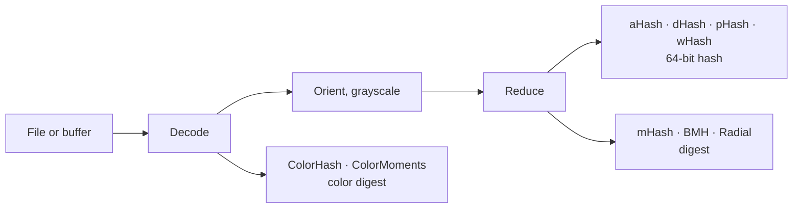

---
hide:
  - navigation
  - toc
---

# libphash

**Perceptual image hashing in C.** Nine algorithms that turn an image into a short
fingerprint, so that a resized copy, a recompressed JPEG or a slightly brighter version of
a picture lands a few bits away from the original, while an unrelated picture lands about
half the bits away.


Above, pHash as the library computes it: the copies keep the original's hash, or nearly,
and the unrelated photograph differs in about half of the 64 bits, which is what two
unrelated hashes do by chance. The same file gives the same hash on Linux, macOS and
Windows, on x86-64 and arm64, in any build with the same
[JPEG decoder](theory/comparing.md#same-hash-on-every-machine).

??? info "The numbers behind the picture"

    --8<-- "docs/assets/generated/home/hero-table.md"

    The copies are three of the edits every algorithm's page measures; the cat is a file
    of the [photo corpus](project/corpus.md).

<div class="grid cards" markdown>

-   :lucide-zap: **Start in five minutes**

    ---

    Install a prebuilt archive or build from source, then hash and compare your first
    images.

    [:octicons-arrow-right-24: Quick start](guide/quickstart.md)

-   :lucide-book-open: **Understand the idea**

    ---

    What a perceptual hash keeps of an image, what it throws away, and what it cannot be
    trusted with.

    [:octicons-arrow-right-24: Perceptual hashing](theory/perceptual-hashing.md)

-   :lucide-scale: **Pick an algorithm**

    ---

    The nine measured side by side, on photographs and on synthetic images: which edits
    each survives, how well it tells pictures apart, and what it costs.

    [:octicons-arrow-right-24: Choosing an algorithm](theory/choosing.md)

-   :lucide-ruler: **Pick a threshold**

    ---

    Which function compares which hash, and how far apart two hashes may be and still be
    the same picture.

    [:octicons-arrow-right-24: Comparing hashes](theory/comparing.md)

-   :lucide-layers: **Hash a whole collection**

    ---

    Many files across a pool of workers, then storing the hashes and searching them.

    [:octicons-arrow-right-24: Hashing many files](guide/batch.md)

-   :lucide-file-code: **Look up a function**

    ---

    Every public function, type and error code, generated from `libphash.h`.

    [:octicons-arrow-right-24: API reference](api/index.md)

</div>

## What it looks like

```c title="examples/basic_hash.c"
--8<-- "examples/basic_hash.c"
```

```sh
cc basic_hash.c -o basic_hash $(pkg-config --cflags --libs libphash)
./basic_hash photo.jpg
```

## What it is for, and what it is not

**For finding duplicate and near-duplicate images in a collection you control:**
deduplicating an archive, clustering a catalog, keying a cache, answering "have I stored
this before" inside a trusted pipeline.

**Not for anything where someone benefits from a wrong answer.** Every hash here is
deterministic and unkeyed, which is what makes deduplication work and also what makes the
hashes straightforward to defeat on purpose. Content moderation, copyright blocklists and
integrity checks on untrusted input need keyed algorithms, and none is implemented here.
The reasoning and the citations are in the
[threat model](theory/perceptual-hashing.md#what-a-perceptual-hash-is-not).

## Nine algorithms, one pipeline



The four 64-bit hashes are compared by Hamming distance; the others return a digest with
its own distance function. [How libphash works](guide/how-it-works.md) follows an image
through these steps; each algorithm has its own page under Theory.

## Performance

Decoding a JPEG, and each hash at its defaults on the decoded image, one thread[^cost]:

--8<-- "docs/assets/generated/home/times.md"

The four 64-bit hashes and BMH cost a small fraction of the decode. mHash and Radial pass
a filter over the image, and cost more than decoding a small one; on a large image they
and the two color hashes come closest to the decode. [Performance](guide/performance.md) has the times against image size and
format, and what lowers them.

## Also available

- **Python:** [python-libphash](https://github.com/gudoshnikovn/python-libphash)
  (`pip install python-libphash`).
- **Upgrading from 1.x:** some hash values change silently; read
  [Migrating from 1.x](guide/migration.md) first.

--8<-- "docs/assets/generated/timing/footnote.md"
