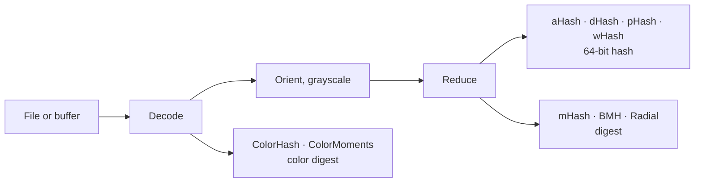

---
hide:
  - navigation
  - toc
---

# libphash

**Perceptual image hashing in C.** Nine algorithms that turn an image into a short
fingerprint, so that a resized copy, a recompressed JPEG or a slightly brighter version of
a picture lands a few bits away from the original, while an unrelated picture lands about
half the bits away.

A hash of a 400×400 photo takes 0.05 ms after a 0.23 ms decode, and the same file gives the
same hash on Linux, macOS and Windows, on x86-64 and arm64.

<div class="grid cards" markdown>

-   :lucide-zap: **Start in five minutes**

    ---

    Install a prebuilt archive or build from source, then hash your first image.

    [:octicons-arrow-right-24: Quick start](guide/quickstart.md)

-   :lucide-book-open: **Understand the algorithms**

    ---

    What perceptual hashing is, and how each of the nine hashes works, where it comes
    from and where it breaks.

    [:octicons-arrow-right-24: Perceptual hashing](theory/perceptual-hashing.md)

-   :lucide-layers: **Hash a whole collection**

    ---

    Batch hashing across a thread pool, and what each item costs.

    [:octicons-arrow-right-24: Hashing many files](batch.md)

-   :lucide-file-code: **Look up a function**

    ---

    Every public function, type and error code, generated from `libphash.h`.

    [:octicons-arrow-right-24: API reference](api/index.md)

</div>

## What it looks like

```c title="examples/basic_hash.c"
--8<-- "examples/basic_hash.c"
```

```sh
cc basic_hash.c -o basic_hash $(pkg-config --cflags --libs libphash)
./basic_hash photo.jpg
```

## What it is for, and what it is not

**For finding duplicate and near-duplicate images in a collection you control:**
deduplicating an archive, clustering a catalog, keying a cache, answering "have I stored
this before" inside a trusted pipeline.

**Not for anything where someone benefits from a wrong answer.** Every hash here is
deterministic and unkeyed, which is what makes deduplication work and also what makes the
hashes straightforward to defeat on purpose. Content moderation, copyright blocklists and
integrity checks on untrusted input need keyed algorithms, and none is implemented here.
The reasoning and the citations are in the
[threat model](theory/perceptual-hashing.md#what-a-perceptual-hash-is-not).

## Nine algorithms, one pipeline



The four 64-bit hashes are compared by Hamming distance; the others return a digest with
its own distance function. Which one to use for which job is measured on
[choosing an algorithm](theory/choosing.md).

## Performance

Hashing an image that is already loaded, and decoding it, on an Apple M3 Pro (one thread):

| | 400×400 JPEG | 5472×3648 JPEG (20 Mpx) |
| --- | --- | --- |
| decode | 0.23 ms | 54 ms |
| aHash, pHash, wHash, BMH | 0.05 ms each | 2.6 ms each |
| dHash | 0.05 ms | 6.3 ms |
| ColorHash, ColorMoments | 0.13, 0.24 ms | 17, 30 ms |
| mHash, Radial | 0.92, 0.60 ms | 33, 49 ms |

## Also available

- **Python:** [python-libphash](https://github.com/gudoshnikovn/python-libphash)
  (`pip install python-libphash`).
- **Upgrading from 1.x:** some hash values change silently; read
  [Migrating from 1.x](guide/migration.md) first.
