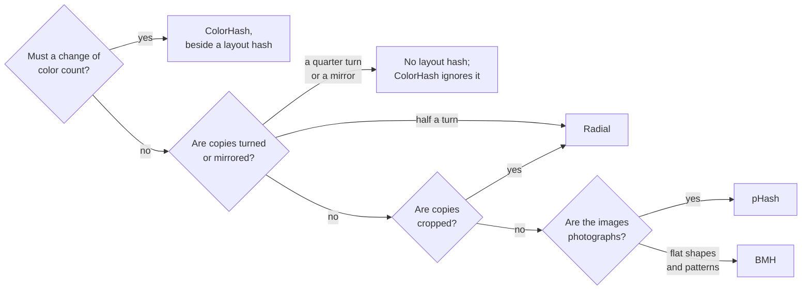

# Choosing an algorithm

The nine algorithms answer the same question, "is this the same picture?", from different
descriptions of an image, and each description survives some edits and not others. This
page puts them side by side on the measurements their own pages make: what each edit does
to each hash, how far apart copies and different images land, what each costs, and how
long its digest is. Every number comes from the two corpora the algorithm pages use, 200
photographs and 24 synthetic images, and from the machine that built this site.

## Four questions



Each answer rests on a chart below:

- **Color.** Seven of the nine hash a gray image, and a hue turned by 30° barely moves them;
  it takes ColorHash about half of the way to an unrelated image
  ([edits that change the picture](#edits-that-change-the-picture)). ColorHash separates
  copies from different images less well than every layout hash but mHash on the
  photographs ([separation](#copies-against-different-images)), and it cannot tell two arrangements of
  the same colors apart, so it goes beside a layout hash, not instead of one.
- **Turns and mirrors.** A quarter turn or a mirror image takes every layout hash about as
  far as an unrelated image. A half turn leaves Radial's digest unchanged, since its
  correlation looks for the profile at every shift. The two color hashes do not see the
  turn at all, and they are the only ones that survive a quarter turn or a mirror.
- **Crops.** A 5 % crop moves Radial least of all, and on the photographs the threshold
  that accepts 95 % of all copies keeps nearly every cropped one; the layout hashes lose
  between one in seven and two in five of them ([Comparing hashes](comparing.md#what-counts-as-a-copy)).
- **Photographs or patterns.** For copies that are neither turned nor cropped, pHash
  separates copies from different photographs best, with no pair of different
  photographs inside its threshold, at the cost of aHash. On the synthetic images, which
  are checkerboards, stripes, rings and discs, pHash is among the worst and BMH is the
  best. The synthetic set has 24 images, and its numbers are the coarser of the two.

Time does not enter the choice above: aHash, pHash, wHash and BMH share one pass over the
image and cost the same, and they are the cheapest four. Radial, the answer to two of the
questions, is the most expensive on a large image ([cost](#cost)).

## What each edit does

Every algorithm measures closeness on its own scale: bits that differ, a correlation, an
intersection, a distance. To set them side by side, each value below is the distance of a
copy from the original's own hash in units of the distance between two typical different
images: 0 is the original's hash, 1 is as far as the median pair of different images of
the corpus. A cell is the median over the corpus. The copies are the ones every algorithm
page charts, one moderate strength of each of nine edits.


- **Recompression, scaling, blur and noise** leave nearly every hash where it was. They
  change pixels, not the layout of light and dark or the mix of colors.
- **Rotation and crop** are the edits the layout hashes feel: they move content between
  the cells of the grid. mHash, which records where fine detail lies to within a few
  pixels, goes most of the way to an unrelated image under either. Radial barely moves
  under a crop.
- **Brightness, contrast and gamma** are the edits the color hashes feel: they move colors
  between bins and shift the moments. The layout hashes compare gray levels with each
  other, with a mean, a median or a neighbor, and these edits keep their order.

A median says where the middle copy lands, not how many copies fall outside a threshold.
Radial's median for a 2° rotation is as small as aHash's, yet its threshold misses a third
of the rotated photographs: on this scale, the threshold that accepts 95 % of Radial's
copies lies closer to 0 than any other algorithm's, and a small move crosses it. [Comparing hashes](comparing.md#what-counts-as-a-copy) counts the copies of
each edit that a threshold keeps.

??? info "The synthetic images"

    
    

    The sharp edges of the synthetic images make mHash feel recompression, scaling and
    noise as well, and pHash feel rotation more; the rest of the pattern is the
    photographs'.

??? info "The numbers behind the chart"

    --8<-- "docs/assets/generated/choosing/copies-table.md"

??? info "How this was measured"

    The values are the ones the algorithm pages chart, read from the cache; nothing is
    measured for this page. Each copy's value is put on the common scale, and the cell
    is the median over the corpus. Below is the code that ran, not a copy of it.

    ```python title="tools/site/pages/choosing.py"
    --8<-- "tools/site/pages/choosing.py:moved"
    ```

    ```python title="tools/site/measure/separability.py"
    --8<-- "tools/site/measure/separability.py:copies"
    ```

    ```python title="tools/site/measure/corpus.py"
    --8<-- "tools/site/measure/corpus.py:corpus"
    ```

    ```c title="tools/site/stages/measure.c"
    --8<-- "tools/site/stages/measure.c:compare"
    ```

    ```sh
    make site
    ```

### Edits that change the picture

Whether these edits should be noticed depends on the collection: a patch over a corner
may be a watermark or a different photograph, a turned hue may be the same product in
another color or a fake. The same scale, every strength of each edit:


- **A turned hue** is seen by ColorHash, half of the way to an unrelated image at 30°.
  ColorMoments, which is dominated by tone, moves far less. The gray hashes barely move on
  the photographs; on the synthetic images, whose pure colors turn into colors of another
  lightness, they do.
- **A turn or a mirror** takes the layout hashes to about 1, and a half turn some of them
  beyond it: a half turn moves every cell of the grid to the opposite one, and the hash
  of that layout can be further from the original than an unrelated photograph's. Radial is the exception for the
  half turn and not for the quarter; the color hashes are unchanged by all three.
- **A patch** moves every hash a little more as it grows. Radial moves the most, then
  pHash; the color hashes, which see only how much of each color there is, the least.

??? info "The synthetic images"

    
    

??? info "The numbers behind the chart"

    --8<-- "docs/assets/generated/choosing/edits-table.md"

## Copies against different images

How far an edit moves a hash matters only against how far apart different images are.
d′ is the gap between the mean of the copies and the mean of the different pairs, in
units of their spread; the second panel is the share of pairs of different images that
the threshold accepting 95 % of the copies lets through as well
([Comparing hashes](comparing.md#choosing-a-threshold) has the curves behind it).


- **On the photographs, pHash separates best**, then dHash; aHash, wHash, BMH and Radial
  follow close together.
- **On the synthetic images the order changes.** BMH leads, and pHash and Radial let
  through more than a tenth of the different pairs. Which hash separates best is a
  property of the collection as much as of the hash, and a collection of drawings or
  screenshots is worth measuring before the choice
  ([on your own collection](comparing.md#measuring-a-threshold-on-your-own-collection)).
- **On the photographs, the color hashes and mHash separate least**: the color hashes
  ignore the layout, so different photographs of similar colors land close, and mHash's
  copies move far.

??? info "The numbers behind the chart"

    --8<-- "docs/assets/generated/choosing/separation-table.md"

??? info "How this was measured"

    Copies and different pairs as on every algorithm page, from the cache: the copies are
    one moderate strength of each edit, the different pairs every pair of distinct images
    of a corpus. Below is the code that ran, not a copy of it.

    ```python title="tools/site/measure/separability.py"
    --8<-- "tools/site/measure/separability.py:separability"
    ```

    ```python title="tools/site/measure/corpus.py"
    --8<-- "tools/site/measure/corpus.py:corpus"
    ```

    ```sh
    make site
    ```

## Cost

The time of a hash grows with the number of pixels in the image, not with the size of
the hash: the grayscale conversion and the reduction to the working size read every
pixel. The chart shows the first hash on a freshly loaded image, so that pass is included,
with the time to decode the same JPEG marked for scale, as measured on the machine that
built this site.[^cost]


- **aHash, pHash, wHash and BMH cost the same**, because the work that grows with the
  image is one area-average pass over the grayscale image, which they share and the
  library caches. What each does on its small grid afterwards takes almost no time.
- **dHash resamples on its own** with a Mitchell filter, which on a large image costs
  about two and a half times the shared pass.
- **The color hashes, mHash and Radial** read every pixel in color, blur the image or
  build a profile around its center: from a few times the cheap four on the small image
  to twenty times on the large one. On the large image Radial and mHash take most of the
  time that decoding the JPEG does.

Computed together, through [`ph_compute_multi()`](../api/hash64.md#ph_compute_multi) or one
after another on the same context, aHash, pHash, wHash and BMH share the pass, and the
second of them costs almost nothing. On a large JPEG,
[`ph_context_set_decode_scale()`](../api/loading.md#ph_context_set_decode_scale) shrinks the
decoding and the hash together ([measured](preparation.md#decoding-at-a-reduced-scale)).

??? info "How this was measured"

    --8<-- "docs/assets/generated/timing/table.md"

    Each case runs once to warm up, then until it has run at least five times and for at
    least a second; the time is the minimum. The grayscale image and the area grid the
    library caches are dropped before every run, so each run is the first hash on a
    loaded image. The cases, and the timing loop:

    ```c title="tools/site/stages/timing.c"
    --8<-- "tools/site/stages/timing.c:time"
    ```

    The times are measured again only when the library, the tool or the machine changes:

    ```python title="tools/site/measure/timing.py"
    --8<-- "tools/site/measure/timing.py:timing"
    ```

## Cost against separation


On the photographs, the cheapest hash is also the best separated: pHash is at the top
left, and nothing to the right of it separates better. An algorithm further right is
worth its time only for an edit the cheap four do not survive, a crop or a half turn for
Radial, a change of color for ColorHash. On the synthetic images the top left belongs to
BMH, at the same cost.

## Summary

--8<-- "docs/assets/generated/choosing/summary.md"

The digest's size is what the algorithm returns: the four 64-bit hashes also come as a
`uint64_t`, which fits an integer column of a database and an index of Hamming distances
([Comparing hashes](comparing.md#hashes-as-text) for the text form). mHash and
ColorMoments are not the answer to any of the four questions above on these corpora;
their pages show what each describes and where it stands.

??? info "How the sizes were read"

    Each digest's size and kind are read from the library, from every algorithm's digest
    of the example photograph:

    ```c title="tools/site/stages/measure.c"
    --8<-- "tools/site/stages/measure.c:sizes"
    ```

--8<-- "docs/assets/generated/timing/footnote.md"
