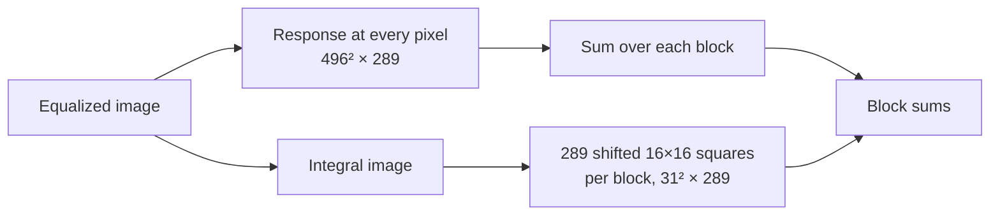

# mHash — Marr–Hildreth Hash

Bring the image to 512×512, spread its gray levels evenly, and pass it through the
Mexican-hat filter of Marr and Hildreth, which answers where the image has edges and
fine detail at the filter's scale. Sum the answer over a 31×31 grid of blocks, and
record, for each block of 64 small windows of that grid, whether it answers more
strongly than its neighbors in the window. The result is 576 bits, a fingerprint of
where the image's detail lies, much finer than the 64 bits of the other hashes and much
more sensitive to where exactly it lies.

| | |
|---|---|
| **Call** | [`ph_compute_mhash()`](../api/digests.md#ph_compute_mhash), or [`PH_ALGO_MHASH`](../api/algorithms.md#PH_ALGO_MHASH) in [`ph_compute_digest()`](../api/algorithms.md#ph_compute_digest) |
| **Output** | digest of 72 bytes, 576 bits, compared with [`ph_hamming_distance_digest()`](../api/compare.md#ph_hamming_distance_digest) |
| **Source** | the operator: Marr and Hildreth, 1980; the hash built on it: pHash's `ph_mh_imagehash()`, which has no paper ([provenance](../algorithm-provenance.md#5-mhash--marrhildreth-hash)) |
--8<-- "docs/assets/generated/mhash/cost-row.md"

## The steps

The steps below are those of the default parameters, a 512×512 image and a kernel reaching
8 pixels from its center;
[`ph_context_set_mhash_params()`](../api/params.md#ph_context_set_mhash_params) sets
others, [below](#parameters). Every picture on this page is computed by the library from
the same photograph, and the digest at the end is what `ph_compute_mhash()` returns for
it.


**1. Grayscale.** Each pixel becomes one luminance value,

$$
Y = \left\lfloor \frac{38R + 75G + 15B}{128} \right\rfloor ,
$$

the same integer approximation of the ITU-R BT.601 weights as for every grayscale hash.
[`ph_context_set_gray_weights()`](../api/params.md#ph_context_set_gray_weights) changes them; [image preparation](preparation.md#grayscale) has why these weights.

**2. Blur.** The grayscale image is blurred at full resolution by a Gaussian of standard
deviation 1 pixel, cut off at 3 pixels on either side and scaled so its seven weights add
up to 1, first along the rows and then along the columns; the edges repeat their last
pixel, and each result is rounded to a whole gray level.

**3. Normalize to 512×512.** The blurred image is resampled to 512×512 with the Mitchell
filter, regardless of its aspect ratio: a wide picture is squeezed, a tall one stretched.
Every image then reaches the filter at the same size, so the filter's scale is the same
fraction of every picture.

**4. Equalize.** Each gray level $v$ is replaced by its rank among the image's
$N = 512^2$ pixels,

$$
v \;\mapsto\; \left\lfloor 255 \cdot \frac{C(v) - C_{\min}}{N - C_{\min}} + \frac12 \right\rfloor ,
$$

where $C(v)$ counts the pixels at level $v$ or below and $C_{\min}$ the pixels at the
darkest level present. The darkest level becomes 0, the brightest 255, and the levels
between spread so that each takes its share of the range.

{ width="560" }
{ width="560" }

The cumulative share becomes a straight line: whatever the exposure, the picture uses
the whole range evenly. A change that keeps the order of the gray levels, such as a
brighter exposure or a tone curve, changes the equalized image only through rounding.

**5. The kernel.** The filter is the Laplacian of Gaussian, sampled as the Mexican hat

$$
K(x, y) = (2 - A)\, e^{-A/2}, \qquad A = \frac{x^2 + y^2}{\alpha^{2\ell}},
\qquad x, y = -s \dots s, \quad s = \lfloor 4 \alpha^{\ell} \rfloor ,
$$

with the defaults $\alpha = 2$ and level $\ell = 1$: $s = 8$, a 17×17 kernel. Its center
is positive, a ring around it negative, and its weights nearly cancel:

--8<-- "docs/assets/generated/mhash/kernel-sum.md"

{ width="640" }
{ width="640" }

The kernel crosses zero at $A = 2$, a distance of $\sqrt 2\, \alpha^{\ell} \approx 2.8$
pixels from its center. On a smooth area it answers almost nothing; on a line or a spot
about that wide it answers strongly, positive on one side of a light-dark change and
negative on the other.

**6. The response.** Each pixel of the equalized image $I$ is replaced by the kernel's
weighted sum around it, the edges repeating their last pixel:

$$
R(y, x) = \sum_{j=-s}^{s} \sum_{i=-s}^{s} K(i, j)\, I(y + j,\, x + i) .
$$

{ width="560" }
{ width="560" }

The response is a map of detail: the spines of the cactus and the rim of the pot light
up, the wall and the table stay pale.

**7. Block sums.** The response is summed over 16×16 blocks, 31 of them across and 31
down:

$$
B(b_y, b_x) = \sum_{y = 16 b_y}^{16 b_y + 15} \; \sum_{x = 16 b_x}^{16 b_x + 15} R(y, x),
\qquad b_y, b_x = 0 \dots 30 .
$$

31 blocks of 16 cover 496 of the 512 pixels; the last 16 rows and columns enter only
through the kernel's reach of the blocks next to them. The library does not compute $R$
at every pixel; it computes these sums directly, [faster](#folding-the-block-sum-into-the-kernel)
and with the same result.

**8. Windows and bits.** The grid is read through 3×3 windows placed every 4 blocks, 8
across and 8 down: 64 windows, nine block sums each. The windows do not touch: every
fourth row and column of the grid, seven of each, belongs to no window, so the digest
reads 576 of the 961 block sums.

{ width="560" }
{ width="560" }

Each block sum in a window is compared with the mean of the nine, and sets its bit when
it is above:

$$
b = \begin{cases} 1 & B > \bar B_{\text{window}} \\ 0 & B \le \bar B_{\text{window}} \end{cases}
$$

{ width="380" }
{ width="380" }

Each bit therefore says where the detail lies *within its window*, which sets the bits
independently of the response's overall strength: the source scales the response to
[0, 1] before this step, and the library leaves that out, since scaling every sum by the
same positive factor and shifting it by the same amount cannot change which side of
their mean any of them falls.

### Folding the block sum into the kernel

Computing $R$ at every pixel of the 496×496 area and then summing it costs
$496^2 \times 289$, some 71 million multiply-adds. The kernel weight does not depend on
the pixel, so it can come out of the block sum:

$$
B(b_y, b_x) = \sum_{j,i} K(i, j) \sum_{(y,x) \in \text{block}} I(y + j,\, x + i) ,
$$

and what is left inside is the sum of a 16×16 square of the image, shifted by $(j, i)$.
An integral image, the table of sums of every top-left rectangle, gives any such square
in four lookups. That makes $31^2 \times 289$, some 280 thousand multiply-adds, 256 times
fewer.



The square sums are exact integers, and only 289 products are added per block, in
double precision. Evaluated the long way, the response sums 289 large products that
nearly cancel, and in single precision the rounding error survives into the block sum.
Most of the time it does not reach a bit; where it does, it is decisive. Here is the
long way against the library's digest, with the response computed in double and in
single precision:

--8<-- "docs/assets/generated/mhash/direct.md"

The synthetic image where single precision decides 108 bits is four flat squares of
color. In a window inside a flat area the nine block sums are equal, every comparison
with their mean is a tie, and rounding alone breaks it. The folded sums break such ties
the same way on every run; a direct evaluation in single precision breaks them by the
order of its additions.

## Digest layout

Bits run window by window, in the order of their numbers above, and within a window row
by row: bit $9w + 3r + c$ is row $r$, column $c$ of window $w$. They are packed most
significant bit first, eight to a byte, so the first window takes all of byte 0 and the
top bit of byte 1.


The order is pHash's; neither paper specifies one. Two digests are compared bit by bit,
so only the count of differing bits matters, not where they are.

## What changes the hash

The hash records where fine detail lies, block by block, to within a few pixels. Anything
that moves the detail across the grid changes it; anything that keeps the detail in
place changes it little.


- **Rotation and cropping** move the hash furthest: a turn of a degree or two, or a crop
  of a few percent, moves the detail by a few pixels at the image's edges, as much as
  the kernel's center is wide, and the block sums near those edges change. A few degrees
  more, or a larger crop, and the digest is as far from the original as an unrelated
  image's, about half of its 576 bits.
- **Brightness, contrast and gamma** keep the order of the gray levels, which
  equalizing turns into the same image up to rounding, until the brightest pixels clip.
  They move a few percent of the bits.
- **Recompression, noise, blur and downscaling** change the fine detail itself, which is
  what the kernel measures; the hash moves with their strength, a few percent of the bits
  at moderate settings.

These are measurements on one photograph; the same edits over two whole corpora follow
below.

??? info "The numbers behind the chart"

    --8<-- "docs/assets/generated/mhash/robustness-table.md"

??? info "How this was measured"

    Each transform is applied alone to the photograph above, and the edited copy is
    saved losslessly, as PPM (as a JPEG of the given quality for that panel). The library
    hashes the original and every copy, and compares each copy with the original by
    [`ph_similarity_digest()`](../api/compare.md#ph_similarity_digest). The chart shows
    $576 \times (1 - \text{similarity})$, which is the Hamming distance: how many of the
    576 bits the edit flipped. Below is the code that ran, not a copy of it.

    The edits, in Python with Pillow:

    ```python title="tools/site/measure/transforms.py"
    --8<-- "tools/site/measure/transforms.py:transforms"
    ```

    Writing the copies and handing them to the measuring tool:

    ```python title="tools/site/measure/robustness.py"
    --8<-- "tools/site/measure/robustness.py:measure"
    ```

    The measuring tool, linked against the library: it computes every algorithm's digest
    of the original, then of each copy, and compares the two by that algorithm's own
    metric.

    ```c title="tools/site/stages/measure.c"
    --8<-- "tools/site/stages/measure.c:measure"
    ```

    ```c title="tools/site/stages/measure.c"
    --8<-- "tools/site/stages/measure.c:compare"
    ```

    The number on the chart:

    ```python title="tools/site/measure/metric.py"
    --8<-- "tools/site/measure/metric.py:bits"
    ```

    To reproduce, `make site` builds the tool and redraws every figure. The tool can also
    be run by hand on any pair of images; it prints one JSON line per variant, with each
    algorithm's comparison:

    ```sh
    cmake --preset release && cmake --build --preset release --target site_stages
    build/release/site_stages measure reference.png variant.png …
    ```

### Over two corpora

The same nine edits, applied to every image of two corpora: 200 public-domain photographs
from Wikimedia Commons ([the list](../project/corpus.md)), and the 24 generated images the
library's tests measure ([methodology](../methodology.md#the-corpus)), which are not
photographs. Each line is the median over the corpus and the band around it holds the
middle half of its images.


The photographs repeat the single image: rotation and cropping reach half of the bits at
a few degrees and a few percent, the other edits stay within a small share of them. The
synthetic images also react to noise. Most of them are flat areas of a few colors, whose
narrow histograms equalizing stretches over the whole range, and with them any noise on
the flat areas: the response then answers to the noise.

### Copies and different images

Robustness alone proves little: a hash that never changes is perfectly robust. What makes
a hash useful is that copies of an image land closer together than different images do.
Here a *copy* is an original after one moderate edit (one strength of each of the nine,
listed under "How this was measured"), and *different images* are every pair of distinct
originals in the corpus.


Different images gather tightly around 288, half of the 576 bits: with that many bits,
two unrelated digests differ in very nearly half of them. Copies split in two. Most land
within a few dozen bits, but the rotated and cropped copies land near half, among the
different images. The threshold that accepts 95 % of the copies has to reach up to them,
and *d′*, the gap between the two means in units of their spread, is the lowest of the
bit hashes on this site. That the threshold still lets few different pairs through is
the tight cluster's doing, not the copies'.

??? info "The numbers behind the charts"

    --8<-- "docs/assets/generated/mhash/corpus-table.md"

??? info "How this was measured"

    For each corpus, every image goes through the nine edits above, and each copy is
    compared with its original exactly as on the single photograph. Every pair of
    distinct originals is compared too, by `site_stages pairs`. Below is the code that
    ran.

    The photographs are downloaded once and checked against the SHA-256 the manifest
    records for each:

    ```python title="tools/site/fetch_corpus.py"
    --8<-- "tools/site/fetch_corpus.py:fetch"
    ```

    Measuring a corpus, or taking the result from the cache when nothing that decides it
    has changed:

    ```python title="tools/site/measure/corpus.py"
    --8<-- "tools/site/measure/corpus.py:corpus"
    ```

    Comparing every pair of originals:

    ```c title="tools/site/stages/measure.c"
    --8<-- "tools/site/stages/measure.c:pairs"
    ```

    The edits that make a copy, and the numbers on the second chart:

    ```python title="tools/site/measure/separability.py"
    --8<-- "tools/site/measure/separability.py:copies"
    ```

    ```python title="tools/site/measure/separability.py"
    --8<-- "tools/site/measure/separability.py:separability"
    ```

    The synthetic corpus is generated by `make_base()` in
    `tests/src/synthetic_corpus.h`, the same code the tests use. `make site` measures
    both corpora and draws every figure.

### Edits that change the picture

The edits above are those a copy goes through. The ones here change what the picture
shows: a patch of the image's own top-left corner pasted over its center, covering 1 to
16 % of the frame; the hue of every pixel turned, which recolors the picture; and a
quarter turn, a half turn and a mirror image. Whether a hash should notice them depends
on what it is for: a search for copies wants to ignore a recoloring, a search for
retouched pictures wants to catch the patch.


Each panel shows how far the edited images land from their originals over both corpora.
The dashed line is the threshold of the chart above, the one that accepts 95 % of the
copies, in each corpus's color: an edited image below it would be taken for a copy.


- **Every patch passes for a copy.** The threshold sits so high, to take in the rotated
  and cropped copies, that even a patch over 16 % of the frame lands far below it.
- **Turning the hue** moves the hash little on photographs, whose muted colors keep
  their luminance under a hue rotation, and far on the flat, saturated colors of the
  synthetic images. Equalizing does not protect against it: a recoloring changes the
  order of the gray levels, not only their spacing.
- **A turn or a mirror image** moves the hash as far as an unrelated image.

??? info "The numbers behind the chart"

    --8<-- "docs/assets/generated/mhash/edits-table.md"

??? info "How this was measured"

    The same measurement as for the copies, over the same images: each edit is applied
    alone to the original, the copy is saved losslessly, and the library compares it with
    the original. The threshold is the one of the chart above, computed from the copies.
    Below is the code of the edits.

    ```python title="tools/site/measure/transforms.py"
    --8<-- "tools/site/measure/transforms.py:content_edits"
    ```

### A small edit against a rescale

A hash that should find edited copies of a picture has to move further for an edit than
for the changes a copy goes through. Here are mHash's median distances for both, the
edits of a copy at the strength that makes one, and the patches:


On the photographs, a patch over 4 % of the frame moves mHash about as far as halving
the image's size, and a 2-degree turn or a 5 % crop moves it several times further than
a patch over 16 %. On the synthetic images, recompression, noise and downscaling move it
further than small patches. The order is the wrong way round for finding edits: mHash
describes where detail lies, and any small shift of the detail outweighs a local
change of it. For aHash, dHash, pHash and wHash the order is the right one: halving the
size moves none of their bits, a patch moves some.

How the nine algorithms compare is on
[choosing an algorithm](choosing.md).

## Cost

mHash is the most expensive of the hashes on a small image. The grayscale conversion, the
blur and the resampling read every pixel of the image and grow with it; the equalizing
and the integral image work at 512×512 whatever the image; the block sums take a fixed
280 thousand multiply-adds. On a large image the blur, at full resolution, is most of
the time.

??? info "How this was measured"

    --8<-- "docs/assets/generated/mhash/timing-table.md"

    Each case runs once to warm up, then until it has run at least five times and for at
    least a second; the time is the minimum. The grayscale image and the area grid the
    library caches are dropped before every run, so each run is the first hash on a
    loaded image. The cases, and the timing loop:

    ```c title="tools/site/stages/timing.c"
    --8<-- "tools/site/stages/timing.c:time"
    ```

    The times are measured again only when the library, the tool or the machine changes:

    ```python title="tools/site/measure/timing.py"
    --8<-- "tools/site/measure/timing.py:timing"
    ```

## Parameters

[`ph_context_set_mhash_params()`](../api/params.md#ph_context_set_mhash_params) sets three
values.

| Parameter | Range | Default | Meaning |
|---|---|---|---|
| `alpha` | above 1 | 2 | the base of the kernel's scale |
| `level` | 0 or above | 1 | its exponent: the kernel reaches $\lfloor 4\alpha^{\ell} \rfloor$ pixels from its center, at most 32 (a 65×65 kernel) |
| `size` | 62 to 4096 | 512 | the side of step 3; the grid stays 31×31, so a block is $\lfloor \text{size}/31 \rfloor$ pixels |

The digest is 576 bits whatever the values, and digests are comparable only when
computed with the same ones. What the hash sees is decided by one ratio: the kernel's
scale against the block's size, both in pixels of the normalized image.

### The kernel's scale

Raising `alpha` or `level` widens the kernel, which then answers to coarser detail. Here
are levels 0, 1 and 2 at `alpha` 2, their kernels drawn to the same scale, and the block
sums each gives:


The block sums keep their overall pattern, the cactus against the plain wall, and change
in detail; a few dozen bits move each way.

### The size

`size` changes the block, not the kernel: at 256 a block is 8 pixels, at 1024 it is 33,
against a kernel that stays 17 pixels wide. The coarser the kernel against the block, the
more the block sums follow the picture's broad layout; the finer, the more they follow
texture. At 1024 the digest of the example is nearly as far from the default's as an
unrelated image's.


The work that depends on `size` grows with its square; the blur, which does not, is the
larger part on a large image. Here is the time against `size` on the two timed images:

{ width="560" }
{ width="560" }

On the small image the time grows slowly up to the default and roughly with the square
of `size` above it; on the large one the blur's cost hides it up to a size several times
the default.

??? info "The numbers behind the chart"

    --8<-- "docs/assets/generated/mhash/cost-size.md"

The defaults are pHash's, which fixes the size at 512 and does not expose it. Across 24
settings of `level` and `size` the property tests' separability moves within a narrow
range with no trend in either, and no setting beats the source's
([provenance](../algorithm-provenance.md#parameters-and-why-the-defaults-are-phashs) has
the sweep).

## Settings that affect it

Five context settings change the pixels mHash reads.

| Setting | Effect on mHash |
|---|---|
| [`ph_context_set_gray_weights()`](../api/params.md#ph_context_set_gray_weights) | the grayscale formula of step 1 |
| [`ph_context_set_load_grayscale()`](../api/loading.md#ph_context_set_load_grayscale) | a JPEG decoder converts to grayscale itself ([measured](preparation.md#the-decoders-grayscale)), which moves gray levels by one here and there |
| [`ph_context_set_auto_orient()`](../api/loading.md#ph_context_set_auto_orient) | on by default: the hash describes the image as displayed, after its EXIF rotation |
| [`ph_context_set_alpha_mode()`](../api/loading.md#ph_context_set_alpha_mode) | how transparent pixels are composited before grayscale ([which background](preparation.md#which-background)) |
| [`ph_context_set_decode_scale()`](../api/loading.md#ph_context_set_decode_scale) | a JPEG read by libjpeg-turbo is decoded at ½, ¼ or ⅛ of its size ([measured](preparation.md#decoding-at-a-reduced-scale)); the blur's σ is fixed in pixels, so a smaller decode changes what mHash reads, and the digest moves at every scale, toward its threshold for copies |

A gray level here and there reaches the response through the kernel, and the block sums
of fine detail are sensitive to it:

--8<-- "docs/assets/generated/mhash/load-grayscale.md"

## In code

mHash returns a digest, like BMH, Radial and the two color hashes. This example computes
all five for two images and compares each pair with the function its kind calls for;
mHash's goes through
[`ph_hamming_distance_digest()`](../api/compare.md#ph_hamming_distance_digest):

```c title="examples/digest_and_metrics.c"
--8<-- "examples/digest_and_metrics.c"
```

## Where it comes from

Two sources cover two halves of mHash. The operator is the Laplacian of Gaussian of
D. Marr and E. Hildreth, "Theory of edge detection" (1980), sampled as the Mexican hat.
The hash built on it has no paper: it is `ph_mh_imagehash()` of the pHash library, by
Evan Klinger and David Starkweather, and Zauner's thesis (2010), which describes it, says
the construction "has not been proposed previously". pHash's code is therefore the primary
source for every step and constant on this page: the blur at 1, the size 512, the 256
levels, the scale $\alpha = 2$, $\ell = 1$, the 16-pixel blocks, the 3×3 windows at
stride 4.

Despite the name, neither pHash nor this library detects edges as Marr and Hildreth do,
by the zero-crossings of the response: the response is summed over blocks and compared
within windows. The operator is theirs; the edge detector is not implemented.

The digest is not bit for bit pHash's. pHash blurs with Deriche's recursive filter and
resamples with a quintic filter, where this library uses a direct Gaussian and the
Mitchell filter; it also computes the block sums the long way. The construction and every
parameter are reproduced; the arithmetic is not
([provenance § 5](../algorithm-provenance.md#5-mhash--marrhildreth-hash)).

--8<-- "docs/assets/generated/timing/footnote.md"
