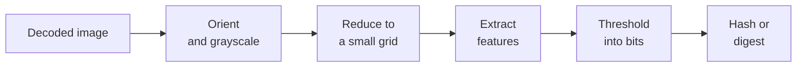

# Perceptual hashing

A cryptographic hash such as SHA-256 is built so that changing one bit of the input changes
about half the bits of the output: two files either are identical or they are not. A
**perceptual hash** is built for the opposite. Two images that *look* the same — a resized
copy, a recompressed JPEG, a slightly brighter version — get hashes that differ in only a
few bits, and the number of differing bits grows as the images look less alike.

That turns "is this the same picture?" into arithmetic on short numbers, which is fast
enough to run over millions of images.

## The common shape

Every algorithm in libphash follows the same pipeline. They differ in the third and fourth
steps: what the image is reduced to, and which features of it become bits.

Reducing the image first is what makes the result *perceptual*. Resolution, compression
artifacts and fine texture are exactly what a "same picture" comparison should ignore, and
an 8×8 or 32×32 grid has no room left for them. What survives is the coarse layout of light
and dark, which is what a person recognizes.
[Image preparation](preparation.md) describes the steps every algorithm shares, up to and
including the reduction.

## Comparing two hashes

The four 64-bit hashes (aHash, dHash, pHash, wHash) are compared by their **Hamming
distance**, the number of bit positions in which they differ:

$$
d(h_1, h_2) = \operatorname{popcount}(h_1 \oplus h_2), \qquad 0 \le d \le 64 .
$$

[`ph_hamming_distance()`](../api/compare.md#ph_hamming_distance) computes it, and [`ph_similarity()`](../api/compare.md#ph_similarity) turns it into a score in
$[0, 1]$. The other five algorithms return a **digest** — a longer bit string, or a vector
of numbers — with a distance function of its own; which function goes with which digest is
on the [algorithms](../algorithms.md#comparing-digests-which-function-for-which-hash) page.

## Choosing a threshold

A comparison ends in a decision: two images are "the same" when their distance is at most
some threshold $t$. Every threshold trades two errors against each other.

- **Too low**, and genuine copies that were edited a little more fall outside it: the
  search misses duplicates (lower recall).
- **Too high**, and unrelated images that happen to share a layout fall inside it: the
  search reports false matches (lower precision).

There is no universal value. It depends on the algorithm, on how much the copies in a
collection are expected to differ, and on which error costs more. The way to pick it is to
measure: hash pairs known to be copies and pairs known to be different from the collection
at hand, and place $t$ between the two distributions.

## An example of the middle steps: aHash

aHash is the simplest of the nine and shows the whole idea in two lines. The image is
reduced to $8 \times 8$ pixels $p_0 \dots p_{63}$, read left to right and top to bottom,
and their mean is computed:

$$
\bar p = \frac{1}{64} \sum_{i=0}^{63} p_i .
$$

Each pixel then contributes one bit, set when the pixel is at least as bright as the mean.
The first pixel goes into the most significant bit:

$$
h = \sum_{i=0}^{63} [\,p_i \ge \bar p\,] \cdot 2^{\,63 - i} .
$$

An edit that keeps the order of pixels relative to the mean keeps every bit: scaling the
brightness, or stretching the contrast around mid-gray, changes the values but not which
side of the mean each one is on. What moves bits is moving content — rotating, cropping,
shifting an object to the other side of the frame flips the bits of every cell it left and
every cell it entered. The [aHash](ahash.md) page measures both kinds.

The other eight algorithms replace the mean with something more robust: differences
between neighbors (dHash), low-frequency DCT coefficients (pHash), a wavelet approximation
(wHash), edges (mHash), block means (BMH), the variance along lines through the center
(Radial), or the distribution of colors (ColorHash, ColorMoments). Each is described, with
its source, on the [algorithms](../algorithms.md) page.

## What a perceptual hash is not

It is not a security mechanism. The hashes are deterministic and public, so anyone can
compute them and construct an image that collides with another, or perturb an image until
it stops matching its own copy. They are for finding duplicates in a collection you
control; the [threat model](../algorithms.md#threat-model-what-these-hashes-are-not)
explains why, with the published attacks.
