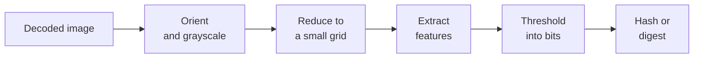

# Perceptual hashing

A cryptographic hash such as SHA-256 is built so that changing one bit of the input changes
about half the bits of the output: two files either are identical or they are not. A
**perceptual hash** is built for the opposite. Two images that *look* the same — a resized
copy, a recompressed JPEG, a slightly brighter version — get hashes that differ in only a
few bits, and the number of differing bits grows as the images look less alike.

That turns "is this the same picture?" into arithmetic on short numbers, which is fast
enough to run over millions of images.

## The common shape

Every algorithm in libphash follows the same pipeline. They differ in the third and fourth
steps: what the image is reduced to, and which features of it become bits.

Reducing the image first is what makes the result *perceptual*. Resolution, compression
artifacts and fine texture are exactly what a "same picture" comparison should ignore, and
an 8×8 or 32×32 grid has no room left for them. What survives is the coarse layout of light
and dark, which is what a person recognizes.
[Image preparation](preparation.md) describes the steps every algorithm shares, up to and
including the reduction.

## Comparing two hashes

The four 64-bit hashes (aHash, dHash, pHash, wHash) are compared by their **Hamming
distance**, the number of bit positions in which they differ:

$$
d(h_1, h_2) = \operatorname{popcount}(h_1 \oplus h_2), \qquad 0 \le d \le 64 .
$$

[`ph_hamming_distance()`](../api/compare.md#ph_hamming_distance) computes it, and [`ph_similarity()`](../api/compare.md#ph_similarity) turns it into a score in
$[0, 1]$. The other five algorithms return a **digest** — a longer bit string, or a vector
of numbers — with a distance function of its own; which function goes with which digest is
on the [comparing hashes](comparing.md#which-function-for-which-hash) page.

## Choosing a threshold

A comparison ends in a decision: two images are "the same" when their distance is at most
some threshold $t$. Every threshold trades two errors against each other.

- **Too low**, and genuine copies that were edited a little more fall outside it: the
  search misses duplicates (lower recall).
- **Too high**, and unrelated images that happen to share a layout fall inside it: the
  search reports false matches (lower precision).

There is no universal value. It depends on the algorithm, on how much the copies in a
collection are expected to differ, and on which error costs more. The way to pick it is to
measure: hash pairs known to be copies and pairs known to be different from the collection
at hand, and place $t$ between the two distributions.
[Comparing hashes](comparing.md#choosing-a-threshold) does it for all nine algorithms.

## An example of the middle steps: aHash

aHash is the simplest of the nine and shows the whole idea in two lines. The image is
reduced to $8 \times 8$ pixels $p_0 \dots p_{63}$, read left to right and top to bottom,
and their mean is computed:

$$
\bar p = \frac{1}{64} \sum_{i=0}^{63} p_i .
$$

Each pixel then contributes one bit, set when the pixel is at least as bright as the mean.
The first pixel goes into the most significant bit:

$$
h = \sum_{i=0}^{63} [\,p_i \ge \bar p\,] \cdot 2^{\,63 - i} .
$$

An edit that keeps the order of pixels relative to the mean keeps every bit: scaling the
brightness, or stretching the contrast around mid-gray, changes the values but not which
side of the mean each one is on. What moves bits is moving content — rotating, cropping,
shifting an object to the other side of the frame flips the bits of every cell it left and
every cell it entered. The [aHash](ahash.md) page measures both kinds.

The other eight algorithms describe the image by something other than cells against
their mean: differences between neighbors ([dHash](dhash.md)), low-frequency DCT
coefficients ([pHash](phash.md)), a wavelet approximation ([wHash](whash.md)), edges
([mHash](mhash.md)), block means on a finer grid ([BMH](bmh.md)), the variance along lines
through the center ([Radial](radial.md)), or the distribution of colors
([ColorHash](color-hash.md), [ColorMoments](color-moments.md)). Each description survives
some edits and not others; [Choosing an algorithm](choosing.md) measures the nine side by
side.

## What a perceptual hash is not

It is not a security mechanism. Every hash here is **deterministic and unkeyed**: the same
file, hashed with the same settings, gives the same value on every machine
([Comparing hashes](comparing.md#same-hash-on-every-machine)), with no shared secret.
That is exactly what deduplication needs, and exactly what makes the hashes trivial to
defeat on purpose.

Someone who wants two visually different images to collide, or one image to stop matching
its own copy, can arrange it. This is not a weakness of any one algorithm: it follows from
being deterministic and public, and it has been demonstrated against traditional and
learned hashes alike. Dolhansky and Canton Ferrer ([DC20] in the
[references](../references.md)) produce exact collisions between unrelated images under
minimal perturbation, and note that an attacker can thereby poison the lookup table of a
duplicate-detection service. A neural embedding in place of a perceptual hash would not
close the gap: such embeddings are not trained for adversarial robustness, and adversarial
examples are that family's oldest known failure mode.

**Use these hashes for** finding duplicates and near-duplicates in a collection you
control, clustering, cache keys, "have I seen this before" in a trusted pipeline.

**Do not use them for** anything where someone benefits from a wrong answer: copyright
enforcement, content moderation, blocklists, checking the integrity of an image. The
literature has algorithms for that problem, and they are **keyed**, so that an attacker
who cannot guess the key cannot aim at the hash. Venkatesan et al. 2000 ([VKJM00]) is the
canonical example, and its key is not an optional extra: the paper calls its randomized
rounding "the crucial source of randomness in the hash function's output". No such
algorithm is implemented here, because a keyed hash solves a different problem from the
one this library is for.

In an adversarial setting, the usual shape is two stages: a fast deterministic hash like
these reduces a collection to a set of candidates, and a heavier comparison that is
harder to steer decides among them. The first stage is what this library is for; the
second is out of its scope.
