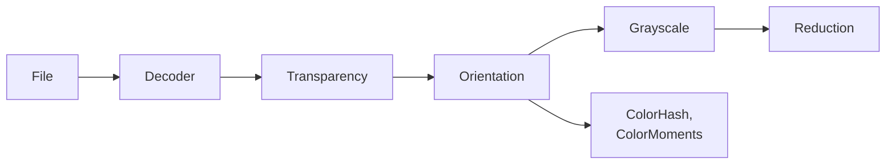
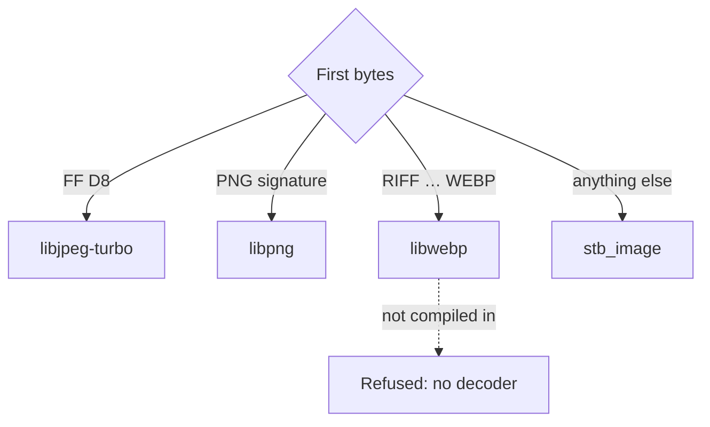

# Image preparation

Every hash in libphash reads an image that the library has already prepared. The file is
decoded, its transparency resolved and the picture turned upright, and for seven of the
nine algorithms it is then converted to grayscale and reduced. This page describes those
steps once, with what each does to a hash and the settings that change it. The
algorithm pages start where it ends.



The first three steps happen once, when the image is loaded by
[`ph_load_from_file()`](../api/loading.md#ph_load_from_file) or
[`ph_load_from_memory()`](../api/loading.md#ph_load_from_memory), which share one decode
path. [`ph_load_from_pixels()`](../api/loading.md#ph_load_from_pixels) takes pixels that
are already decoded: it resolves their transparency and carries no orientation. The last
two happen inside each hash, and the grayscale image is kept for the next hash of the same
image.

## Decoding

The first bytes of the file choose the decoder. Each native decoder claims its own format,
and stb_image takes whatever none of them claimed.



stb_image is always compiled in. It reads BMP, GIF (the first frame of an animation),
TGA, PSD, HDR, PIC and PNM, and JPEG and PNG in a build without their native decoder;
[`ph_get_build_info()`](../api/build.md#ph_get_build_info) says which decoders a build has.
It has no WebP decoder, so WebP without libwebp is refused as
[`PH_ERR_DECODER_UNAVAILABLE`](../api/errors.md#PH_ERR_DECODER_UNAVAILABLE) rather than as
an unknown format. TIFF is not read by any of them. Two JPEG decoders do not agree to the
last level on every pixel: the example photograph's 64-bit hashes are the same from
libjpeg-turbo and from stb_image, but its mHash, Radial, ColorHash and ColorMoments
digests are not, and the library's tests keep one set of reference hashes per JPEG
decoder for that reason.

A decoded file must reach its own end: the end-of-image marker of a JPEG, the `IEND` chunk
of a PNG, the size a WebP's RIFF header states. A file cut short is refused as
[`PH_ERR_CORRUPT_DATA`](../api/errors.md#PH_ERR_CORRUPT_DATA), by every decoder, rather
than hashed as the part of a picture that arrived.

### Size limits

The dimensions a file's header declares are checked before any pixel buffer is allocated,
so a small file that claims an enormous image costs nothing:

| Limit | Value |
|---|---|
| Pixels, width × height | [`ph_context_set_max_pixels()`](../api/loading.md#ph_context_set_max_pixels), 256 × 1024 × 1024 by default; 0 leaves only the ceiling below |
| Pixels, always | 2 147 483 647 (`INT_MAX`): the library indexes pixels in `int` |
| Width or height, always | 1 000 000, so that an image of one enormous row cannot pass the area limit |
| Encoded file | 2 GiB − 1 byte |

An image over a limit is refused as
[`PH_ERR_IMAGE_TOO_LARGE`](../api/errors.md#PH_ERR_IMAGE_TOO_LARGE). A JPEG decoded at a
[reduced scale](#decoding-at-a-reduced-scale) is judged by its full dimensions: a scale
request does not make a decompression bomb safe.
[`ph_load_from_pixels()`](../api/loading.md#ph_load_from_pixels) is held to the pixel
limits only, as it has no decoder to protect.

## Transparency

A transparent pixel looks like whatever is behind it, and the color a file stores under it
is invisible and arbitrary: one encoder writes black there, another white. Right after
decoding, before anything else, the library composites every image that has an alpha
channel (or a PNG `tRNS` chunk) onto a background, per channel,

$$
c' = \left\lfloor \frac{c \cdot a + b \cdot (255 - a) + 127}{255} \right\rfloor ,
$$

with $b$ = 128 by default, 255 or 0 if
[`ph_context_set_alpha_mode()`](../api/loading.md#ph_context_set_alpha_mode) chooses white
or black. `PH_ALPHA_IGNORE` drops the alpha channel and keeps the stored color, as
ImageHash does. A loaded image never has an alpha channel.


The two files look the same in any viewer. With alpha ignored the library sees two
different pictures; composited, it loads the same pixels from both.

### The color under transparent pixels

Here every image of both corpora is cut out the same way, in an ellipse of its own place
and size, and stored twice, with black and with white under the transparent part. The two
files of each image are compared:

--8<-- "docs/assets/generated/preparation/alpha-hidden.md"

- **With alpha ignored**, the two files of one image land as far apart as unrelated
  images, or farther: for aHash the background turns from below the mean to above it, and
  nearly every bit flips.
- **Composited**, the two files hash identically, for every algorithm: they load the same
  pixels. The build checks it for every image.

### Which background

The background is a picture of its own, and with much of the frame transparent it decides
much of the hash. Over the same cut-outs, here is how well each background lets copies be
told from different images (*d′* and the threshold as in the corpus charts of the algorithm
pages, with the copies cut out after their edit):

--8<-- "docs/assets/generated/preparation/alpha-backgrounds.md"

No background is best for every algorithm, and the reason is in each algorithm's threshold.
A flat background is a block of equal cells, and when it covers more than half of the
frame its value is the median of the grid:

- **On white, wHash** sets no bit at all, because it sets a bit only above the median and
  no cell is brighter than white: every image with more than half of its cells
  transparent gets the hash `0000000000000000`.
- **On black, BMH** sets every bit, because it sets a bit at or above the median and every
  block is at least black.
- **On gray, aHash** loses the images whose visible part averages near mid-gray. The
  background cells equal 128, the mean of the grid lies close to it, and a small edit that
  moves the mean across 128 flips every background bit at once. **ColorMoments**, whose
  digest is the mean, spread and skew of each channel over every pixel, also separates the
  cut-outs worst on gray, on both corpora.
- **pHash, dHash, mHash and ColorHash** let almost no different pairs through on any of
  the three. Radial does the same on the photographs, and on the synthetic images it too
  does worst on gray.

Gray is the default because it is the one background on which neither median hash
collapses, though wHash does better on black. Its price is aHash and ColorMoments, and
Radial on the synthetic images, when the visible part is close to mid-gray. A collection
of such images hashed with those is better composited on white or black. The cut-outs here are photographs and synthetic images inside an ellipse:
artwork drawn on a transparent canvas has other shapes, and the shape is part of what
every hash sees.

??? info "How this was measured"

    Each image of both corpora is cut out in an ellipse whose center and radii are drawn
    from a generator seeded with the image's number, so an image and its copies share it.
    For the color under transparent pixels, the two files of each image are compared by
    `site_stages measure`, once with `--load=alpha=ignore` and once with the default. For
    the backgrounds, each original is cut out, and each of its nine copies (the
    separability chart's) is edited first and cut out after; the copies are compared
    with their original and every pair of originals is compared, loaded with each
    background. `--load=` sets the context before the files after it are loaded.

    ```python title="tools/site/pages/preparation.py"
    --8<-- "tools/site/pages/preparation.py:cutout"
    ```

    ```python title="tools/site/pages/preparation.py"
    --8<-- "tools/site/pages/preparation.py:copies"
    ```

    ```python title="tools/site/pages/preparation.py"
    --8<-- "tools/site/pages/preparation.py:settings"
    ```

    ```c title="tools/site/stages/util.c"
    --8<-- "tools/site/stages/util.c:load-settings"
    ```

## Orientation

A camera stores a picture the way its sensor read it, and an EXIF *Orientation* tag (TIFF
tag `0x0112`, values 1 to 8) tells a viewer how to turn or mirror it for display. The
library reads the tag from a JPEG's `APP1` Exif segment, a WebP's `EXIF` chunk or a PNG's
`eXIf` chunk, and applies it after the transparency and before any hash, so that a hash
describes the picture as a viewer shows it. Values 5 to 8 swap the width and the height.


Each of the eight files loads as the same upright picture, pixel for pixel; the build
fails if one does not. With
[`ph_context_set_auto_orient()`](../api/loading.md#ph_context_set_auto_orient) off, the
library hashes the pixels as stored, and the same eight files hash as eight pictures:

--8<-- "docs/assets/generated/preparation/orientation.md"

That is as far as a turned or mirrored copy goes on the algorithm pages, where the turns
and the mirror are among the [edits that change the picture](ahash.md#edits-that-change-the-picture):
far enough to be taken for a different image.

A missing or malformed tag reads as 1, no transform, and never fails a load. Applying a
real orientation takes a second buffer the size of the image; if it cannot be allocated,
the load fails as a whole rather than hashing the picture on its side.

??? info "How this was measured"

    The example photograph, cropped to a landscape frame, is stored eight times as PNG,
    each turned or mirrored the way a camera with that tag would store it, with the tag in
    the file's `eXIf` chunk. Pillow's own reading of each tag is checked first. The library
    loads every file with the tag read and with it ignored (`site_stages loaded`), and
    the tool compares the pixels with the upright picture and with the stored one.

    ```python title="tools/site/pages/preparation.py"
    --8<-- "tools/site/pages/preparation.py:orientation"
    ```

    ```c title="tools/site/stages/prepare.c"
    --8<-- "tools/site/stages/prepare.c:loaded"
    ```

## Grayscale

aHash, dHash, pHash, wHash, mHash, BMH and Radial read one luminance value per pixel:

$$
Y = \left\lfloor \frac{38R + 75G + 15B}{128} \right\rfloor ,
$$

an integer approximation of the ITU-R BT.601 weights (0.299, 0.587, 0.114). The sum is
shifted down by seven bits, so the result is truncated, not rounded.
[`ph_context_set_gray_weights()`](../api/params.md#ph_context_set_gray_weights) takes other
weights and scales them to sum to 128, the red and green shares rounded down and blue
taking the rest; [`ph_context_get_gray_weights()`](../api/params.md#ph_context_get_gray_weights)
reads back what is used.

The grayscale image is computed by the first hash that needs it and kept until the next
load, so the seven algorithms on one image pay for it once. An image that is already
gray is used as it is. ColorHash and ColorMoments read the color channels instead, and
refuse a one-channel image with
[`PH_ERR_REQUIRES_COLOR`](../api/errors.md#PH_ERR_REQUIRES_COLOR).

### Why 38, 75 and 15

The closest 8-bit approximation of the same weights would be 77, 150 and 29 over 256,
nearer to BT.601 on every channel. Over both corpora, with the copies and different pairs
of the corpus charts:

--8<-- "docs/assets/generated/preparation/gray-weights.md"

On the photographs the two give the same separability. On the synthetic images,
38/75/15 separates a little better for aHash, wHash, BMH and mHash, and a little worse for
Radial. Being closer to the
standard does not make a hash better at telling images apart.

??? info "How this was measured"

    The 77/150/29 grayscale is computed by the tool from the decoded image and loaded as
    a one-channel image (`--load=weights=77/150/29/8`); the same path with 38/75/15 over
    128 gives exactly the library's hashes, which the build checks on the example
    photograph. The library's own figures are those of the corpus charts.

    ```python title="tools/site/pages/preparation.py"
    --8<-- "tools/site/pages/preparation.py:settings"
    ```

### The decoder's grayscale

[`ph_context_set_load_grayscale()`](../api/loading.md#ph_context_set_load_grayscale) asks
the decoder for one channel instead of three, which saves the library's conversion. What
the decoder returns depends on the format:

- **JPEG**: libjpeg-turbo returns the luma the file stores, without computing color at
  all.
- **PNG and the formats stb_image reads**: the decoder converts with the library's
  default weights, 38/75/15; weights set with
  [`ph_context_set_gray_weights()`](../api/params.md#ph_context_set_gray_weights) do not
  reach it.
- **WebP**: libwebp has no grayscale output, so the library converts as usual.

So the setting changes the pixels a hash reads only for JPEG. Over the photographs:

--8<-- "docs/assets/generated/preparation/decoder-gray.md"

The stored luma is rounded where the library's formula truncates, so about half of the
pixels come out one level brighter; a few differ by more. A level here and there tips only
the values that lie next to a threshold. The 64-bit hashes stay the same or move by a bit
or two; mHash and BMH, with many more bits, move on most photographs, by a few. With the setting on, ColorHash and
ColorMoments refuse the image.

??? info "How this was measured"

    Every photograph, as the JPEG file it is, is loaded with the library's grayscale and
    with the decoder's (`--load=gray=decoder`); `site_stages loaded` writes both
    grayscale images, and `site_stages measure` compares the hashes.

    ```c title="tools/site/stages/prepare.c"
    --8<-- "tools/site/stages/prepare.c:loaded"
    ```

## Reduction

Each grayscale hash then brings the image down to what it describes. Four of them share
one method, the exact area average; the others filter.

| Algorithm | What it reduces the grayscale image to |
|---|---|
| [aHash](ahash.md) | an 8×8 area average |
| [dHash](dhash.md) | 9×8 by the Mitchell filter |
| [pHash](phash.md) | a 32×32 area average (the `dct_size`) |
| [wHash](whash.md) | a 16×16 area average; in the full mode, a box filter to the largest power of two that fits the shorter side |
| [BMH](bmh.md) | a 16×16 area average (the `block_size`) |
| [mHash](mhash.md) | a Gaussian blur of σ = 1 at full size, then 512×512 by the Mitchell filter |
| [Radial](radial.md) | a Gaussian blur of σ = 3.5 at full size; its lines are sampled from the whole image |

ColorHash and ColorMoments reduce nothing: they count every pixel of the color image.

### The area average

The grid divides the image into equal areas, whatever its size and aspect ratio. Each cell
is the mean of every pixel it covers, a pixel the cell only partly covers counting by the
part covered, rounded half up. The arithmetic is in integers, so the result is exact and
the same on every platform.


The middle column of cells spans pixels 3⅓ to 6⅔, and the top row rows 0 to 3½: the
pixels on the outlined cell's edges count by two thirds or by a half, and those in its
lower corners by a third.
--8<-- "docs/assets/generated/preparation/area.md"
The build recomputes every cell from these weights and fails if one differs from the
library's.

The library keeps the area sums of the image on a 32×32 grid. Any grid whose side divides
32 is assembled from those sums, and comes out bit for bit as a pass of its own would, so
aHash (8×8), wHash (16×16), BMH (16×16) and pHash (32×32) on one image read its pixels
once. An image smaller than 32 pixels on a side, or a grid that does not divide 32, takes a
pass of its own.

Why an area average rather than a filter is measured on the [aHash page](ahash.md#why-an-exact-area-average):
it separates copies from different images best on both corpora. dHash compares
neighboring cells, and an area average flattens a pattern finer than a cell into equal
neighbors; [why it uses the Mitchell filter](dhash.md#why-mitchell-not-an-area-average)
is on its page.

??? info "How this was measured"

    A 10×7 grayscale image, the center of the example photograph reduced by Pillow, is
    reduced to 3×2 by the library (`site_stages area`), and every cell is recomputed from
    the coverage of each pixel in exact fractions.

    ```python title="tools/site/pages/preparation.py"
    --8<-- "tools/site/pages/preparation.py:area"
    ```

    ```c title="tools/site/stages/prepare.c"
    --8<-- "tools/site/stages/prepare.c:area"
    ```

### Blur and gamma

mHash and Radial blur the grayscale image at full size before they reduce or sample it,
so that what they read are shapes rather than pixels; the [mHash](mhash.md#the-steps) and
[Radial](radial.md#sigma) pages show what the blur does. Radial alone then applies a gamma,
[`ph_context_set_gamma()`](../api/params.md#ph_context_set_gamma), which is 1, no change,
by default; it lives on the context but no other algorithm reads it.

## Decoding at a reduced scale

A JPEG can be decoded straight to ½, ¼ or ⅛ of its width and height, by
[`ph_context_set_decode_scale()`](../api/loading.md#ph_context_set_decode_scale): libjpeg-turbo
scales the blocks of the compressed image as it decodes them, and a side that does not
divide evenly is rounded up. Only JPEG through libjpeg-turbo is decoded this way; a PNG, a
WebP, or a JPEG in a build whose JPEG decoder is stb_image is decoded in full whatever the
setting.

On a 20-megapixel photograph:

--8<-- "docs/assets/generated/preparation/decode-scale-times.md"

The decode itself gets only somewhat cheaper, because every coefficient of the file is
still read. Everything after it reads every decoded pixel, and shrinks with their number:
four times fewer at each step. The saving is largest for the hashes that cost the most
per pixel, mHash and Radial.[^cost]

What it costs is the hash: the image a hash reads is smaller. Here every image of both
corpora, as a JPEG, is decoded at each scale and compared with the same file decoded in
full, against the threshold that accepts 95 % of the copies on each algorithm's page:


- **What matters is the size decoded, not the scale.** The photographs are 1280 pixels
  wide, so an eighth is 160; the synthetic images are 160, so an eighth is 20. On the
  20-megapixel photograph, whose eighth is still 684 pixels wide, no hash moves more than a
  few bits at any scale:

    --8<-- "docs/assets/generated/preparation/decode-scale-large.md"

- **The 64-bit hashes and BMH** average the image into a few cells, and keep nearly every
  hash at every scale, down to images a few times their grid.
- **mHash** blurs by a σ fixed in pixels and then resamples to 512×512, so a smaller
  decode changes what it reads: it moves at every scale, toward its copy threshold.
- **Radial** samples its lines from the blurred image at full size, with a blur fixed in
  pixels, and it moves the most: at an eighth of a 1280-pixel photograph, most digests
  fall outside the threshold for copies.
- **ColorHash and ColorMoments** count colors, and a smaller decode keeps their
  proportions: they stay within their thresholds for nearly every image.

??? info "The numbers behind the chart"

    --8<-- "docs/assets/generated/preparation/decode-scale.md"

??? info "How this was measured"

    Every photograph is read as the JPEG file it is; every synthetic image is encoded as
    a JPEG at quality 95 first. Each file is compared by `site_stages measure` with
    itself, decoded at each scale (`--load=scale=half` and so on). The thresholds are
    those of the corpus charts of each algorithm's page. The times are cases of
    `site_stages time`, each a load and, where named, a hash.

    ```python title="tools/site/pages/preparation.py"
    --8<-- "tools/site/pages/preparation.py:scale"
    ```

    ```c title="tools/site/stages/timing.c"
    --8<-- "tools/site/stages/timing.c:time"
    ```

## Settings that change it

| Setting | Step | Default |
|---|---|---|
| [`ph_context_set_max_pixels()`](../api/loading.md#ph_context_set_max_pixels) | [size limits](#size-limits) | 256 × 1024 × 1024 pixels |
| [`ph_context_set_decode_scale()`](../api/loading.md#ph_context_set_decode_scale) | [decoding](#decoding-at-a-reduced-scale), JPEG only | full size |
| [`ph_context_set_alpha_mode()`](../api/loading.md#ph_context_set_alpha_mode) | [transparency](#transparency) | composited on gray |
| [`ph_context_set_auto_orient()`](../api/loading.md#ph_context_set_auto_orient) | [orientation](#orientation) | on |
| [`ph_context_set_load_grayscale()`](../api/loading.md#ph_context_set_load_grayscale) | [the decoder's grayscale](#the-decoders-grayscale) | off |
| [`ph_context_set_gray_weights()`](../api/params.md#ph_context_set_gray_weights) | [grayscale](#grayscale) | 38, 75, 15 |
| [`ph_context_set_gamma()`](../api/params.md#ph_context_set_gamma) | [Radial only](#blur-and-gamma) | 1 |

The first five are read when an image is loaded, so they apply to the next load; the last
two are read by the hash. Hashes are comparable only when computed with the same settings.

--8<-- "docs/assets/generated/timing/footnote.md"
